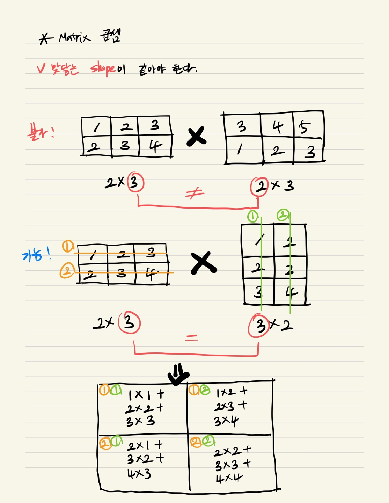

## numpy - array

```python
import numpy as np # numpy를 가져오고 이름을 np라고 짓는다.

arr = np.array([1, 2, 3, 4], dtype=int)

print(arr, arr.shape, type(arr))
# [1 2 3 4] (4,) <class 'numpy.ndarray'> 요렇게 출력됨
# shape은 행렬의 길이?라고 생각하면 된다. 1차원 arr라서 4만 출력 
# type은 배열이긴 배열인데 numpy만의 arr이므로 numpy.ndarray라고 출력된다.

mylist = [[1,2,3,4], [7,8,9,0]]

arr2 = np.array(mylist)

print(arr2, arr2.shape, type(arr2))
# [[1 2 3 4]
# [7 8 9 0]] (2, 4) <class 'numpy.ndarray'> 요렇게 출력됨


# arr은 데이터타입이 단일이어야 한다 
# 걍 타입을 바꿔버림 ex) int랑 str 혼재되어 있고 dtype 지정 안하면 int를 자동으로 str로 바꿈

#아래와 같은 경우 그냥 정수화 되어버림
arr3 = np.array([1,2,3,4,3.14], dtype=int)
```


## numpy - slicing

```python
# 1차원 arr일 경우
arr = np.array([0,1,2,3,4,5,6,7,8,9,10])

print(arr[2])
# 2출력

print(arr[-1])
# 맨 마지막 10 출력

print(arr[-3])
# 8 출력

# print(arr[11])
# 범위 넘어가서 에러

# 2차원 arr일 경우
arr2 = np.array([[1,2,3,4],
				[5,6,7,8],
				[9,10,11,12]])
print(arr2[0,3])
# 4출력

# 슬라이싱
# row(행)을 모두 가져오려는 경우
print(arr2[0, :])  # 0번째 로우 가져오고, 행은 모두 가져오라는 뜻

# column(열)을 모두 가져오려는 경우
print(arr2[:, 2]) # 로우는 다 가져오고, 2번째 행을 가져오라는 뜻

# 부분적으로 가져오려는 경우
print(arr2[:2, :]) # 로우는 0,1 가져오고 행은 다 가져오라는 뜻
print(arr2[:2, 2:]) # 로우는 0,1 가져오고 행도 0,1까지만 가져오라는 뜻
```


## numpy - fancy 인덱싱

```python
arr = np.array([10,2,3,4,5,6,7,8,9,10])

print(arr[[1,3,5]]) # 1,3,5번째 요소를 가져와라
```


## boolean indexing

```python
arr = np.array([1,2,3,4,5,6])

myTrueFalse = [True, True, True, False, False, True]  # 위에 arr의 갯수와 맞춰서 T/F 정해주고

print(arr[myTrueFalse])
#1,2,3,6만 출력됨


arr2 = np.array([[1,2,3,4],
				 [5,6,7,8],
				 [9,10,11,12]])

# 조건필터

print(arr2 > 3) # arr2중에 3 초과인 친구들만 boolean index로 뽑아줘

# [[False False False True]
#  [True True True True]
#  [True True True True]
#  [True True True True]] 요렇게 출력됨

print(arr2[arr2 > 2]) # 위 친구를 index로 활용해서 2 초과인 친구 출력가능
```


## arange

```python
arr = np.arange(1, 11)

print(arr)
# [1 2 3 4 5 6 7 8 9 10] 출력됨

arr2 = np.arange(start=1, stop=11)
print(arr2)
# 마찬가지로 [1 2 3 4 5 6 7 8 9 10] 출력됨

# 세번째 인자는 step, 2칸씩 건너뛴다
arr3 = np.arange(1, 11, 2)
print(arr3)
# [1 3 5 7 9] 출력됨

arr4 = np.arange(start=1, stop=11, step=2)
print(arr4)
# 동일하게 [1 3 5 7 9] 출력됨
```


## sort


```python
arr = np.array([10,5,3,8,1,5,7,5,6,10,15,16,41])
print(np.sort(arr))
# [ 1  3  5  5  5  6  7  8 10 10 15 16 41] 오름차순 출력

print(np.sort(arr)[::-1])
# [41 16 15 10 10  8  7  6  5  5  5  3  1] 내림차순 출력

# N차원 정렬

arr2 = np.array([[5,6,7,8],
				 [4,3,2,1],
				 [10,9,12,11]])

print(arr2.shape) # (3,4) 출력됨 axis0 = 3이자 행이고, axis1 = 4이자 열이다. 

print(np.sort(arr2, axis=1)) # 열 기준으로 정렬해줘

# [[ 5  6  7  8]
#  [ 1  2  3  4]
#  [ 9 10 11 12]] 출력

print(np.sort(arr2, axis=0)) # 행 기준으로 정렬해줘

# [[ 4  3  2  1]
#  [ 5  6  7  8]
#  [10  9 12 11]] 출력


# argsort -> sort를 하긴 하지만 정렬된 값들의 인덱스!! 를 출력해준다.
print(np.argsort(arr2, axis=1))

# print(np.sort(arr2, axis=1)) 의 값은 아래와 같고
# [[ 5  6  7  8] 
#  [ 1  2  3  4]
#  [ 9 10 11 12]] 출력

# print(np.argsort(arr2, axis=1))는 원래 행렬이었던 아래의 행렬에서 위의 np.sort(arr2, axis=1)을 실행했을 때 해당 값의 원래 인덱스값을 보여줌
# arr2 = np.array([[5,6,7,8],
#		   		   [4,3,2,1],
#	 	  		   [10,9,12,11]])  


# [[0 1 2 3]
#  [3 2 1 0]
#  [1 0 3 2]]
```


## Matrix

```python
# 덧셈, 뺄셈, 곱셈

# shape이 같아야한다.
# 같은 position끼리 연산한다.

#[[1,2,3],   +   [[3,4,5],    =   [[4,6,8],
# [2,3,4]]  	  [1,2,3]]   	   [3,5,7]]

# 일반 곱셈
a = np.array([[1,2,3],
		      [2,3,4]])

b = np.array([[3,4,5],
		      [1,2,3]])

print(a*b)

# [[3 8 15]
#  [2 6 12]]

# dot product(일반곱셈이 아닌 조금 다른 행렬간의 곱셈) -> 맞닿는 shape이 같아야 한다.

c = np.array([[1,2,3],
		      [2,3,4]])

d = np.array([[1,2],
			  [2,3],
			  [3,4]])

print(np.dot(c, d))

# [[14 20]
#  [20 29]]
```


### dot product




## Broadcasting

```python
a = np.array([[1,2,3],
			  [4,5,6]])

print(a+3)

# [4 5 6]
# [7 8 9]
```

