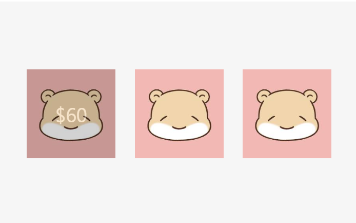
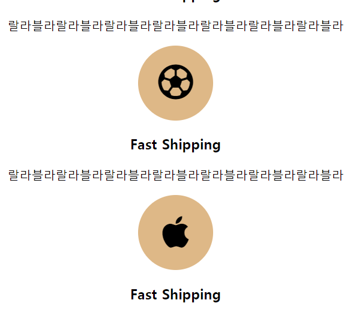
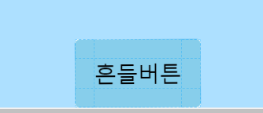
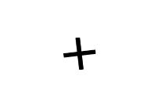
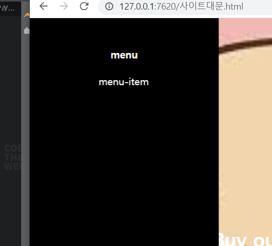
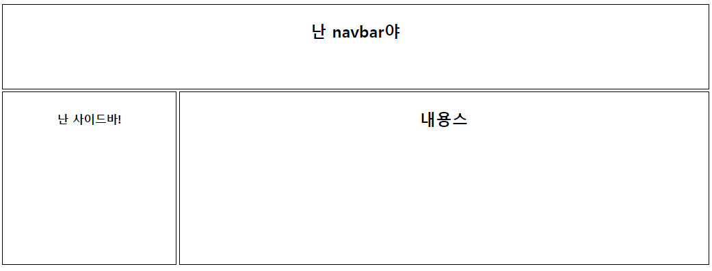
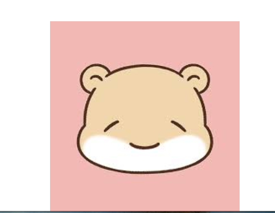
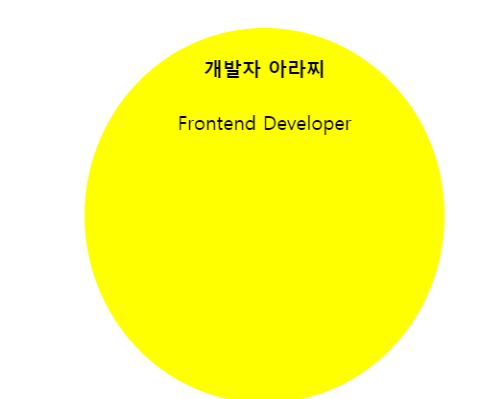

## html 기본

```css
이미지 가운데 정렬.

style="display: block;
       margin: auto;"

글자 가운데 정렬
text-align : center;

특정 문자 강조하기
<p>Front-end <span style="color : red">Developer</span></p>

굵게 처리하기
<strong></strong> 으로 감싸기
font-weight 사용하기
```


## html에 CSS파일 가져와서 관리하기

```html
<head>
    <meta charset="UTF-8">
    <title>Document</title>
    <link rel="stylesheet" href="css/main.css"> // css파일과 연결
</head>
```

class 누르고 컨트롤 + E 누르면 html 파일에서 바로 CSS 수정 가능


## class, id 사용하기

직접 넣은 스타일 > id > class > 태그   // 순으로 우선순위가 적용됨

```html
// profile.html

<html>
<head>
    <meta charset="UTF-8">
    <title>Document</title>
    <link rel="stylesheet" href="CSS/main.css">
</head>
<body>
  
  <h4 class="title">아라찌</h4>
  <p id="special">Front-end <span style="color : red">Developer</span></p>
  
</body>
</html>
```

```css
// main.css

class 선언
.profile {
  width: 200px;
  margin: auto;
  display: block;
}


.title {
  text-align: center;
  font-size: 26px;
}

ID 선언
#special {        
  text-align: center;
}
```


## 박스 설정

```css
.description {
  text-align: center;
  width: 400px;
  background-color: antiquewhite;
  /*박스 디자인시 자주 쓰는 스타일링*/
  margin: auto;
  display: block;
     block 뜻 : 한 행을 전부 차지해주세요! 즉 그 다음에 오는 친구들은 밑      으로 내려간다 but 이상황에선 지워도 됨 왜냐면 div 태그가 block속성      을 갖고 있기 때문
  padding: 30px;
  border: 4px solid black;
  font-size: 25px;
  border-radius: 5px;
}
```


## 레이아웃 1 float

```css
// 우선 전체를 싸메는 container라는 div박스를 만들어주는 것이 좋다 

float : left; 
float는 공중에 붕 떠서~ 왼쪽에 정렬된다 그러므로 공간을 차지 하지 않음!!
붕 뜨는 속성 해결하기 위해 뒤에 오는 div박스에 clear: both; 사용하기

다만 또 글씨 & 글씨에서는 붕뜨는 속성 적용안되는 일종의 버그!

```


## 레이아웃 2 inline-block

```css
// inline-blokc은 옆으로 배치해주세요!또한 글씨처럼 공백, 엔터키를 렌더링해줌

.left2 {
  display: inline-block;
}
.right {
  display: inline-block;
  vertical-align: top;
  // inline 속성을 갖고 있다면 글자가 baseline으로 기본세팅 되어 있기 떄문에 top으로 바꿔줘야 정상적으로 글자가 제자리 찾아감
}

<html>
<head>
    <meta charset="UTF-8">
    <title>Document</title>
    <link rel="stylesheet" href="CSS/main.css">
</head>
<body>
  
  <div class="container">
    <div class="header"></div>
    <div class="left2"></div><!--
 --><div class="right2">
      <p>안녕하세요</p>
    </div>

  </div>
    
</body>
</html>

```


## 블로그형태 만들기

```css
레이아웃은 네모네모 박스들 설계부터 시작!

style="margin: 0px 10px 50px 4px;" // 시계방향으로 상우좌하 설정 가능

```


## 반응형 웹 만들기

- breakpoint
  아주 작은 모바일 576px < 모바일or태블릿 768px < 태블릿 992px < WEB 1200px

```css
style="font-size : 1rem;"
폰트 사이즈를 비율적으로 정해주기

style="font-size: 2em;"
X em = 부모 폰트사이즈의 X 배

vw, vh
현재 내가 보고있는 view의 몇 %를 차지하는지


.CSS 파일

web/모바일에 따른 반응형 먹여주기

.main-title {
    color: white;
    text-align: center;
    font-size: 50px;
}


화면의 폭이 768px(모바일) 이하일 때 아래의 css 적용하도록 하자! 조건문같은 느낌
@media screen and (max-width: 768px){
    .main-title {
        font-size: 30px;
        display: none; // 안보이게 해버리기!
    }
}
```


## 반응형 웹 만들기 2

```html
.html파일


  <div class="explain-container">
  
    <div>
      <h4>Fast Shipping</h4>
      <p>lorem ipsum</p>
    </div>
    <div>
      <h4>Fast Shipping</h4>
      <p>lorem ipsum</p>
    </div>
    <div>
      <h4>Fast Shipping</h4>
      <p>lorem ipsum</p>
    </div>
    <div>
      <h4>Fast Shipping</h4>
      <p>lorem ipsum</p>
    <div style="float: none; clear: both;"></div
       // explain-container 안의 div들한테 float를 먹였을땐 그 아래에 clear:both;를 넣어줘           야 아래부터 float 속성이 깨짐  
           float: none을 또 먹인 이유는 css를 explain-container div 라고 먹였기 때문임
    </div>
    
  </div>

```

```css
.css 파일

// 기본 WEB 환경에서는 일자로 정렬

.explain-container {
  text-align: center;
  margin-top: 70px;
  max-width: 1200px;
  margin: auto;
  margin-top: 70px;
}
.explain-container div {
  margin-top: 40px;
  float: left;
  width: 25%;
}

// 태블릿의 경우 2열 종대

@media screen and (max-width: 992px){
    .explain-container {
      max-width: 800px;
    }
    .explain-container div {
        float: left;
        width: 50%;
    }
}


// 모바일의 경우 세로로 정렬

@media screen and (max-width: 768px){
    .explain-container div {
        float: none;
        width: 100%;
    }
}


* 더 넓은 breakpoint를 보다 위에 설정해준다 
```


## 반응형 웹사이트 만들기 3 / Bootstrap Grid

utilities-spacing 에서 확인 가능!

margin -> mt-5, ml-5, mr-5, mb-5, m-5

padding -> pt, pl, pr, pb, p

Layout - Grid에서 확인

```html
    <div class="container">
      <div class="row">
        <div class="col-md-4">안녕</div>  
          md(768px)이상에서만 4컬럼씩 차지하세요 그 이하에선 세로 정렬
        <div class="col-md-4">안녕</div>
        <div class="col-md-4 order-first">안녕1</div> 순서 정해주기
      </div>
    </div>
```


## clear 속성이란?

float로 붕떠서 안먹히는 margin을 clear줄로 해결하기

``` html
<div style="clear: both"></div>를 내가 float로 이루어진놈 이랑 내가 margin먹이는 놈 사이에 쏙 하고 밀어넣어주면 원하는대로 margin 먹일 수 있음!
```


## navbar 만들기

```html
selector로 편하게 class 부여하기
class li-inline 안에 있는 모든 li 태그는 같은 스타일을 공유합니다.

.css 

.li-inline li{
  display: inline-block;
}

.html

  <nav>  // 기능은 div 태그랑 똑같지만 웹접근성을 위해 nav라고 명시해주자!
         // 유사한놈들로 section, footer 등 있음
    <ul class="li-inline text-center">
      <li><a href="#">IT</a></li>
      <li><a href="#">맛집</a></li>
      <li><a href="#">동물</a></li>
      <li><a href="#">뷰티</a></li>
    </ul>
  </nav>

```

```css
a태그 밑줄 없애기
.css

.li-inline a {
  text-decoration: none;
}

+ a태그 방문 후에 색깔 검은색으로 해주기

.li-inline a:visited {
  color : black;
}
```


## 사이트 대문 만들기

```css
body {
    margin: 0px;
}
기본적으로 body태그는 margin을 머금고 있음 사이트 꽉차게 보일라면 이거 설정해주기!

.main-background {
  width: 100%;
  height: 500px;
  background-image: url(../images/%EB%8B%A4%EC%9A%B4%EB%A1%9C%EB%93%9C.jfif);
  background-size: cover;  // background 꽉 채우기
  background-repeat: no-repeat;  // 반복 X
  background-position: center; // 배경이 어디서부터 채워질지 정할수 있음
  background-attachment: fixed; // 스크롤에 따라 여부
}
```


## margin 버그

예를 들어 div박스가 딱 붙어있으면 안쪽 div에 margin을 주더라도 바깥 div에 준 것 처럼 작동함!

margin이 위아래서 오면서 겹쳐도 마찬가지임!

둘 중 하나에 padding 초 살짝 넣어주고 margin 먹이는 방법 가능


## 버튼 디자인

```css
.main-button {
  padding: 10px;  // 버튼 사이즈
  font-size: 18px;
  font-family: fantasy;
  background-color: white;
  border: none;  // 테두리 없애기
  display: block;  // 가운데정렬 1
  margin: auto;  // 가운데정렬 2
}
```


## position

1. 디폴트값은 static인데 꿈쩍안하고 안움직임!

2. position: relatvie 해주면 요소들이 자유롭게 이동 가능!

3. position : fixed 스크롤로 움직여도 그대로 고정!

   left : 20px 

   top : 20px  왼쪽에서 20px, 위에서 20px 이동한 곳에서 달라붙어라!

4. position: absolute

   - 자신의 부모박스가 기준점임!
   - 단 붙게하고 싶은 부모박스에게 
     - position: relative라고 설정해줘야함!
     - 가운데정렬 하는 법
       - .position {
           position: absolute;
           left: 0;
           right: 0;
           margin: auto;
           width: 150px;
         }


## 반응형 박스만들기

```css
max-width : 700px;
단 max-width는 padding은 포함하지 않음! 그렇기 때문에 padding을 부여하면 max-width가 먹히지 않음

-> 이걸 해결하기 위해서 
box-sizing: border-box 
요걸 쓰면 박스크기를 padding과 border까지 포함하게 설정한다!


-> main.css 같은곳에
div {
    box-sizing: border-box;
}
같은 걸 해주면서 기본값 세팅으로 해주는게 좋다
```


## flex box

```css
.css

.flex-container {
  display: flex;
  justify-content: center;  // start end spcae-around space-between
  align-items: center; // 상하 가운데 정렬
}


flex-direction: column; -> 세로 정렬
flex-wrap: wrap; 가로폭이 넘치면 밑으로 밀어 내려버림
flex-grow: 2; 총 폭의 x배를 차지합니다 navbar같은거 만들때 가운데에 빈 칸 넣어줄때 용이함

.flex-box {
  width: 100px;
  height: 100px;
  background-color: grey;
  margin: 5px;
}
```

```html
  <div class="flex-container">
    <div class="flex-box"></div>
    <div class="flex-box"></div>
    <div class="flex-box"></div>
    <div class="flex-box"></div>
  </div>
```


100vh 100 vw


## form input

```css
input [type=text] {
    padding: 20px;
}
# input 태그 중에 type이 text인 친구만 관리해줘
```

```css
    <form>
      <input type="text" placeholder="하이루" name="firstname" class="sample-input">
      <input type="email">
      <input type="checkbox">
      <input type="file">
      <select>
        <option>aaa</option>  
        <option>bbb</option>  
        <option>ccc</option>  
      </select>
      <textarea rows="10" cols="50">긴 인풋</textarea>
      <input type="submit" value="보내기"> 
      <button type="submit">전송버튼</button>
    </form>
```

## Contact us 만들기


```css
div, input, textarea {
  box-sizing: border-box;
}

.form-background {
  margin-top: 150px;
  padding: 30px;
  width: 100%;
  background-color: rgba(0, 0, 0, 0.5);
}

.form-input {
  padding: 15px;
  font-size: 18px;
  border-radius: 4px;
  border: 1px solid lightgrey;
  width: 100%;
}

.form-half {
  width: 100%;
  display: flex;
  justify-content: space-between;
}

.form-half div {
    widht: 50%;
}

.form-checkbox {
  width: 100%;
  padding: 10px;
}

.btn-submit {
  color: white;
  width: 100px;
  padding: 10px;
  background-color: coral;
  border: none;
  border-radius: 10px;
  display: block;
  margin-left: 80%;
  cursor: pointer;
}
```

```html
 <div class="form-background">
    <div class="form-white">
      <h3>Contact Us</h3>
      <form>
        <div>
          <p>Your Email</p>
          <input class="form-input" type="email">
        </div>
        <div class="form-half">
          <div>
            <p>First name</p>
            <input class="form-input" type="text">
          </div>
          <div>
            <p>Last name</p>
            <input class="form-input" type="text">
          </div>
        </div>
        <div>
          <p>Message</p>
          <textarea class="form-input" rows="5"></textarea>
        </div>
        <div class="form-checkbox">
          <input type="checkbox" id="check"> <label for="check">글씨</label>
        </div>
        <button class="btn-submit" type="submit">SEND</button>
      </form>
    </div>
```


## 쓸데많은 Table 만들기

```css
table {
  border-collapse: collapse;   // border끼리 겹치게 하기
}

td, th {
  border: 1px solid grey;
  padding: 10px;
  vertical-align: bottom;  // 수직 정렬
}
```

```html
  <h5>테이블</h5>
  <div>
    <table>
      <thead>
        <tr>
          <th>제목sssssssssss</th>
          <th>제목ssssssssss</th>
          <th>입니sssssss</th>
        </tr>
      </thead>
      <tbody>
        <tr>
          <td><p>dafasfs</p><p>asdfasdfas</p></td>
          <td>2ddddddddd</td>
          <td>3dddddddd</td>
        </tr>
        <tr>
          <td>1dddddddddd</td>
          <td>2ddddddddd</td>
          <td>3ddddddddd</td>
        </tr>
      </tbody>
    </table>
  </div>
```


## Cart Table 만들기


```css
.cart-background {
  width: 100%;
  padding: 20px;
  background-color: lightblue;
}

.cart-form-container {
  width: 100%;
  max-width: 700px;
  margin: auto;
  background-color: white;
}

.cart-table {
  background: white;
  width: 100%;
}

.cart-footer {
  width: 100%;
  max-width: 700px;
  margin: auto;
  margin-top: 20px;
  display: flex;
  justify-content: space-between;
  
}

.cart-btn {
  color: white;
  background-color: navy;
  padding: 10 30;
  cursor: pointer;
}


```

```html
  <div class="cart-background">
    <h3>Your Shopping Cart</h3>
    <div class="cart-form-container">
      
      <table class="cart-table">
        <thead>
          <tr>
            <th class="cart-img"></th>
            <th class="cart-item">item</th>
            <th class="cart-amount">Amount</th>
            <th class="cart-price">Price</th>
            <th class="cart-total">Total</th>
          </tr>
        </thead>
        <tbody>
          <tr>
            <td></td>
            <td>아라찌</td>
            <td class="cart-amount">1</td>
            <td>70000원</td>
            <td class="cart-total-price">70000원</td>
          </tr>
          <tr>
            <td colspan="5" style="text-align: right" class="cart-total-price">총 70000원</td>
          </tr>
        </tbody>
      </table>
    </div>
    <div class="cart-footer">
      <a href="">Edit your shopping cart</a>
      <button class="cart-btn">Choose Payment Method</button>
    </div>
  </div>
```


## 예쁜 버튼 만들기 hover

```css
// btn css
.cart-btn {
  color: white;
  border: none;
  border-radius: 5px;
  padding: 10 30;
  cursor: pointer;
  background-color: coral;
}

.cart-btn-brown {
    background-clor: navy;
    color: white;
}

/*마우스 올려졌을 때*/
.cart-btn:hover {
  background-color: chocolate;
}

/*클릭 후 커서가 찍혀있는 상태*/
/*
.cart-btn:focus {
  background-color: red;
}
*/

/*클릭중*/
.cart-btn:active {
  background-color: brown;
}

// a태그 css
.custom-link {
  text-decoration: none;
}

/*방문 전 링크*/
.custom-link:link {
  color: black;
}

/*방문 후 링크*/
.custom-link:visited {
  color: red;
}
```

```html
a태그로 만들때
<a role="button" class="cart-btn">버튼</a>
<button cart-btn cart-btn-brown>
  클래스 중첩 사용 
</button>
```


## 폰트 스타일링

```css
body {
    margin:0;
    font-family: 'gulim', 'gothic';
}

// 영어로 쓰기 권장, 여러개를 적용해두면 만약 gulim체가 없을 시 gothic을 쓴다!


폰트 커스텀
@font-face {
  font-family: '이쁜폰트';
  src : url(nanumsqareR.ttf);
}
```


## 애니메이션

1. 시작화면 제작
2. 최종하면 제작
3. transition / 트리거 제작



```css
.overlay {
  position: absolute;
  width: 100%;
  height: 100%;
  background-color: rgba(0,0,0,0.5);
  opacity: 0;  // 시작화면 투명도0 
  transition: all 1s; // css 속성이 바뀔때마다 1초에 걸려서 변경해줌
  transition-delay: 2s; // css 속성 바뀌기 전 대기시간
  transition-timing-function: // 처음에 빨리 동작할건지 나중에 빨리 동작할건지 등
  overflow: hidden // 부모요소 벗어나는 친구들 짤라버리기
}
.overlay:hover {
    opacity: 1;
}
```

```html
<div style="position: relative">
    <div class="overlay"></div>
    
</div>
```


```css
// 아래에서 위로 올라가는 애니메이션


absolute, relative, top, overflow 등으로 만들어보자

.wrap-overlay:hover .overlay-black {    // 자식 요소에 가능
    top: 50%
}
```


## 아이콘 넣기



```css
.expain-container {
  text-align: center;
  margin: auto;
  max-width: 1200px;
  margin-top: 70px;
}

.expain-container i {
  background-color: burlywood;
  width: 100px;
  height: 100px;
  border-radius: 50px;
  padding-top: 25px;
  box-sizing: border-box  // box sizing 멈춰!
}
```


## 애니메이션 - 흔들 버튼




```css
.ani-button {
  padding: 20px;
  font-size: 22px;
  background: skyblue;
  margin: auto;
  display: block;
  margin-top: 50px;
  border: none;
  border-radius: 5px;
  cursor: pointer;
}

.ani-button:hover {
  animation-name: shake;
  animation-duration: 1s;
}

@keyframes shake {
  0% {
    =transform: rotate(0deg)
  }
  25% {
    transform: rotate(-8deg)
  }
  50% {
    transform: rotate(8deg)
  }
  75% {
    transform: rotate(-8deg)
  }
  100% {
    transform: rotate(0deg)
  }
}
```


## 애니메이션 - 버튼 각도 틀며 커지기



```css
.ani-x {
  margin: 150px; auto;
  text-align: center;
  font-size: 70px;
  width: 84px;
  cursor: pointer;
}

.ani-x:hover {
  animation-name: tox;
  animation-duration: 1s;
  animation-fill-mode: forwards;
}

@keyframes tox {
  0% { transform: rotate(0deg) }
  25% { transform: rotate(-15deg) }
  100% {transform: rotate(45deg) scale(2)}
}
```


## 애니메이션 - 움직이는 메뉴 UI




```css
.navbar1 {
  width: 300px;
  background: black;
  color: white;
  height: 100%;
  padding: 25px;
  position: fixed;
  text-align: right;
  z-index: 5;
  transform: translateX(-210px);
  transition: all 1s;
}

.navbar1:hover {
  transform: translateX(0px);
  text-align: center;
}

.navbar1-item {
  transform: translateX(-400px);
  transition: all 1s;
}

.navbar1:hover .navbar1-item {
  transform: translateX(0px);
}
```

```html
  <div class="navbar1">
    <h4>menu</h4>
    <p class="navbar1-item">menu-item</p>
  </div>
```


## 미래지향적인 Grid 레이아웃



```css
.grid-container {
  display: grid;
  grid-template-columns: 1fr 1fr 1fr 1fr;
  grid-template-rows: 100px 100px 100px;
  grid-gap: 3px;
  padding: 10px;
}

.gird-nav {
  grid-column: 1 / 5;
/*  1부터 4만큼의 컬럼 갯수를 차지합니다!*/
  text-align: center;
}

.grid-sidebar {
  grid-row: 2 / 4;
  text-align: center;
}

.grid-content {
  grid-column: 2 / 5;
  grid-row: 2 / 4;
  text-align: center;
}
```

```html
  <div class="grid-container">
    <div class="gird-nav"><h3>난 navbar야</h3></div>
    <div class="grid-sidebar"><h5>난 사이드바!</h5></div>
    <div class="grid-content"><h3>내용스</h3></div>
  </div>
```


## Position sticky

```css
.sticky {
  position: sticky;
  top: 100px;
  float: right;
}
// 주의점: top과 같은 좌표설정을 꼭 해줘야함!
```


## 종이처럼 뒤집히는 프로필사진 만들기






```html
<div class="flip-outer">
    <div class="flip-inner">
     
      <div class="back">
        <h4>개발자 아라찌</h4>
        <p>Frontend Developer</p>
      </div>
    </div>
  </div>

```

```css
.flip-outer {
  width: 300px;
  height: 300px;
  margin: auto;
}

.flip-inner {
  width: 100%;
  height: 100%;
  position: relative;
  transition: all 1s;
  transform-style: preserve-3d;  // 3D처럼 움직이도록 중복 X
}

.flip-inner:hover {
  transform: rotateY(180deg);
}

.front {
  width: 100%;
  position: absolute;
  backface-visibility: hidden;  // 돌렸을 때 그림자 X
}

.back {
  width: 100%;
  text-align: center;
  position: absolute;
  transform: rotateY(180deg);
  /*  나중에 뒤집을때 글씨 똑바로 보이게 미리 뒤집어 놓기!*/
  background: yellow;
  width: 100%;
  height: 100%;
}
```

