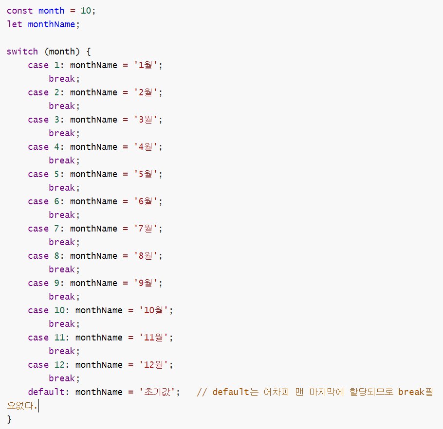

# 1. 변수


### 변수란 무엇이고 왜 사용하는가??!

변수는 하나의 값을 저장하기 위해 확보한 메모리 공간 자체, 또는 그 메모리공간을 식별하기 위해 붙인 이름이다. 개발자가 직접 메모리 주소를 통해 값을 저장하고 치환할 경우 시스템 오류가 날 수 있기 때문이다. 변수(식별자)는 값이 아니라 메모리 주소를 기억하고 있다. 


### 키워드란 ?

자바스크립트 엔진은 키워드를 만나면 자신이 수행해야 될 약속된 동작을 수행한다.

키워드 ex) var, let, const, function, class

var라는 키워드의 경우 var 뒤에 오는 변수이름으로 새로운 변수를 생성하고, 값을 지정하지 않은 경우 초기값을 undefined로 설정하는 '약속된 동작'을 수행한다.

 

 

### 변수 호이스팅

자바스크립트는 기본적으로 코드를 인터프리터에 의해 한 줄씩 순차적으로 실행되는 동기적인 방식을 취하고 있다. 하지만 변수선언의 경우 (값을 할당한 상태는 아님) 런타임이 아니라 그 이전 단계에서 먼저 실행되기 때문에 변수를 선언한 부분보다 위쪽에서 console을 찍어도 var 변수의 초기값인 defined가 출력되는 것을 볼 수 있다. 


하지만 변수 할당 (값을 넣는 것)은 런타임 도중에 일어나므로 중간에 값을 할당하면 아래와 같은 결과가 나온다.


###  

### 자바스크립트 식별자 네이밍 규칙

변수를 명명할 때 프로그램언어 별로 선호하는 명명방식이 있다. 자바스크립트의 경우는 아래와 같다.


# 2. 표현식과 문


### 표현식

표현식은 값으로 평가될 수 있는 문이다. 즉, 표현식이 평가되면 새로운 값을 생성하거나 기존값을 참조한다. **쉽게 생각해서 값으로 평가될 수 있는 문은 모두 표현식이다. 아래의 문 모두 표현식이다.**


 

### 문(statement)

문은 프로그램을 구성하는 기본단위이자 최소 '실행' 단위이다. 최소의 문장이라고 생각하면 좋을 것 같다. 이러한 문의 집합으로 이뤄진 것이 바로 프로그램이며, 문을 작성하고 순서에 맞게 나열하는 것이 프로그래밍이다. 문은 여러개의 token으로 이루어졌다. token이란 문법적인 의미를 가지며, 더 이상 나눌 수 없는 코드의 기본요소를 말한다. 


## 3. 데이터 타입

why 데이터 타입이 필요할까

```
값은 메모리에 저장하고 참조할 수 있어야 한다. 메모리에 값을 저장하려면 먼저 확보해야 할 메모리 공간의 크기를 결정해야하는데 데이터 타입을 통해 몇 바이트의 메모리 공간을 낭비와 손실 없이 이용할지 결정할 수 있다.

또한 2진수로 저장되어 있는 메모리에서 2진수를 읽고 이것을 사람들이 이해할 수 있는 언어로 표시할 때 이 2진수를 어떻게 해석할지 결정하기 위해서도 데이터타입이 필요하다.
```


자바스크립트는 7개의 데이터 타입을 제공한다.

1. 숫자 타입
   - 숫자. 정수와 실수 구분 없이 하나의 숫자 타입만 존재
2. 문자열 타입
   - 문자열
3. 불리언 타입
   - 논리적 참(true)와 거짓(false)
4. undefined 타입
   - var 키워드로 선언된 변수에 암묵적으로 할당되는 값
5. null 타입
   - 값이 없다는 것을 의도적으로 명시할 때 사용하는 값
6. 심벌 타입
   - ES6에서 추가된 7번째 타입
7. 객체 타입
   - 객체, 함수, 배열 등


#### 숫자 타입

```
C나 자바, 파이썬의 경우는 정수와 실수를 구분해서 int, long, float, double등과 같은 다양한 숫자 타입을 제공한다. 하지만 자바스크립트는 독특하게 하나의 숫자 타입(실수)만 존재한다.
```


#### 문자 타입

```javascript
다른 타입과 달리 문자열은 따옴표(큰 따옴표, 작은 따옴표, 백틱 中 1)로 감싼다. 그 이유는 키워드나 식별자와 같은 토큰과 구분하기 위해서다.
또한 문자열은 변경 불가능한 값이다. 문자열이 생성되면 그 문자열을 변경할 수 없다는 것을 의미한다. 

문자 타입끼리 +를 하면 각 문자열을 연결할 수 있다.

// 문자열 삽입
var first = 'HyunSik'
var last = 'Jo'

console.log(`My name is ${first} ${last}.`) // My name is Hyunsik Jo.
```


#### 불리언 타입

```
논리적 참, 거짓을 나타내는 true와 false뿐이다.
특정 상태를 나타낼 때 자주 사용된다.
```


#### undefined 타입

```
var 키워드로 선언한 변수는 암묵적으로 undefined로 초기화된다. 변수 선언에 의해 확보된 메모리 공간을 처음 할당이(변수에 값을 넣는 행위) 이뤄질 때까지 빈 상태(대부분 비어있지는 않고 쓰레기 값이 들어있다.)로 내버려두지 않고 자바스크립트 엔진이 undefined로 초기화한다. 따라서 변수를 선언한 이후 값을 할당하지 않은 변수를 참조하면 undefined가 반환된다.
```


#### null 타입

```
변수에 값이 없다는 것을 명시하고 싶을 때 null을 할당한다.
```


#### 심벌 타입

```javascript
심벌은 ES6에서 추가된 7번째 타입으로, 변경 불가능한 원시 타입의 값이다. 심벌 값은 다른 값과 중복되지 않은 유일무이한 값이므로 주로 이름이 충돌할 위험이 없는 객체의 유일한 프로퍼티 키를 만들기 위해 사용한다. 심벌은 Symbol 함수를 호출해 생성한다. 이 때 심벌값은 다른 값과 절대 중복되지 않는 유일무이한 값이다.

// Symbol 함수로 심벌값 생성하기
var key = Symbol('key');
console.log(typeof key); // symbol
```


#### 객체 타입

```
자바스크립트는 객체 기반의 언어이다. 자바스크립트를 이루고 있는 거의 모든 것이 객체란 뜻이고 이는 곧 앞에서 살펴본 6가지의 데이터 타입 이외의 값은 모두 객체 타입이란 뜻이다. 
```


## 4. 연산자


#### 산술 연산자

```javascript
// ++,-- 연산자

var x = 1;

// ++,-- 연산자는 피연산자의 값을 변경하는 암묵적 할당이 이뤄진다.
x++;
console.log(x); // 2 출력 (기존의 x에 x+1을 할당한 것)

// +,- 연산자는 숫자 타입이 아닌 피연산자의 경우 피연산자를 숫자 타입으로 변환하여 반환한다.

var x = '1'

console.log(+x) // 1출력
console.log(-x) // -1 출력

var y = 'Hello'

console.log(+y) // 문자열은 숫자타입으로 변환 할 수 없으므로 NaN을 반환한다.
```


#### 할당 연산자

할당 연산자는 우항에 있는 피연산자의 평가 결과를 좌항에 있는 변수에 할당한다.

```javascript
var x;

x = 10
console.log(x); // 10

x += 5 // x = x + 5 라는 뜻
console.log(x); // 15

x *= 5 // x = x * 5 라는 뜻
console.lgo(x); // 75

var str = 'My name is';
str += 'Lee' // str = str + 'Lee'라는 뜻
console.log(str) // My name is Lee 
```


#### 삼항 조건 연산자

삼항 조건 연산자는 첫 번째 피연산자가 true로 평가되면 두 번째 피연산자를 반환하고, 첫 번째 피연산자가 false로 평가되면 세 번째 피연산자를 반환한다.

```javascript
조건식 ? 조건식이 true일 때 반환할 값 : 조건식이 false일 때 반환할 값

var score = 70;

var score >= 60 ? 'pass' : 'fail'; // pass 출력
```


```javascript
const mypage = document.querySelector('.mypage');
 document.addEventListener('click', function clickOutside(event) {
  if (event.target.closest('.mypage')) return;
  setpopover(false);
});

// 할당한 포지션 외에 다른 곳 클릭했을 때 함수!
```


## 변수, object..!

variable -> 일반 저장

object -> object를 가리키는 레퍼런스가 메모리에 저장된다...! 그래서  const로 선언해도 변경이 가능한거임


## Operator

|| 연산자는 true가 나오면 더이상 연산을 안함! 따라서 무거운 함수를 뒤쪽에 배치하는게 좋음!

반대로 && 역시 false나오면 더이상 연산 안하므로 무거운 함수를 뒤쪽에 배치하는게 좋음!


=== object 비교할때 


## if / 반복문

```javascript
const name = 'elie'

if (name==='elie') {
    console.log('elie')
} else if (name==='tom') {
    console.log('tom')
} else {
    console.log('unknown')
}

let i = 3
while (i>0) {
    console.log(`while: ${i}`)
    i--
}

do {
    console.log(`do while: ${i}`)
    i--
} while (i > 0);

for (i = 3; i>0; i--) {
    console.log(`for: ${i}`)
}
```


### **1. if ... else 문 vs 삼항 조건 연산자**





위와 같은 if ... else문을


요렇게 삼항조건연산자를 통해 간편하게 만들 수 있다!

 

하지만 조금 다른점! 위의 if ... else문과 다르게 삼항연산자는 result라는 변수에다가 할당을 한다. 여기서 두 조건문의 차이점이 나온다. "var % 2 ? '홀수' : '짝수' "는 **표현식**이다. 즉, 삼항 조건 연산자는 값으로 평가되는 **표현식**을 만든다. 따라서 삼항 조건 연산자 표현식은 값처럼 사용할 수 있기 때문에 변수에 할당할 수 있다. 하지만 if... else 문은 말 그대로 **문**이다. 따라서 값처럼 사용할 수 없기 때문에 변수에 할당할 수 없다.

 

조건에 따라 단순히 값을 결정하여 변수에 할당하는 경우 : **삼항 조건 연산자!**

조건에 따라 실행해야 할 내용이 복잡하여 여러 줄의 문이 필요하다면 : **if ... else문**

을 사용하는 것이 가독성에 좋다.

 

 

### **2. switch문 폴스루**

switch문은 문자열이나 숫자의 분기를 통해 실행할 코드 블록을 결정해야 할 때 주로 사용한다. 


하지만 위와 같은 예제를 실행해보면 '10월'이 출력되지 않고 '초기값'이 출력된다. 이는 switch 문이 case 문을 통해 실행 흐름이 이동하여 문을 실행하는 것은 맞지만 문을 실행한 후에 switch를 바로 탈출하지 않고 switch문이 끝날 때까지 이후의 모든 case 문과 default 문을 실행했기 때문에 발생한다. 즉 case10에서 monthName='10월'이 할당된 후에 11, 12, default까지 재할당되며 마지막엔 '초기값'이 재할당 된 것이다. 이러한 현상을 **폴스루(fall through)**라고 한다. 

따라서 올바른 switch문은 case마다 **break**를 걸어주는 아래와 같다.

 


# 객체

자바스크립트는 객체 기반의 프로그래밍 언어이며, 자바스크립트를 구성하는 거의 "모든 것"이 객체다. 원시 값을 제외한 나머지 값(함수, 배열, 정규 표현식 등)은 모두 객체다.

객체는 다양한 타입의 값을 하나의 단위로 구성한 복합적인 자료구조다. 또한 객체는 **변경가능한 값**이다.  아래와 같이 age, gender라는 key와 28, 'Man'이라는 value라고 이루어진 것이 hyunsix라는 객체이다.

```javascript
const hyunsix = {
    age: 28,
    gender: 'Man'
}
```


원시값(String, Number 등)과 객체의 가장 큰 차이점은 