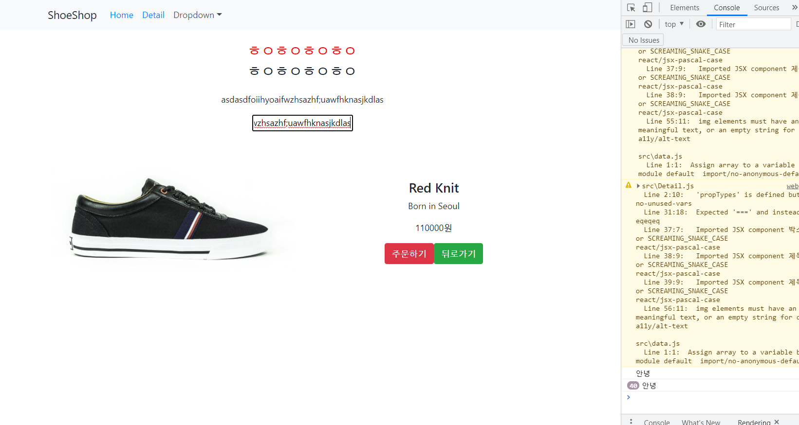

## 프로젝트 생성 & 부트스트랩 설치

yarn이 더 빠름!

- 설치 : npm install --global yarn
- web 실행 : yarn start
- 부트스트랩 설치
  - react bootstrap 검색
  - npm install react-bootstrap bootstrap@4.6.0  / npm install 대신 yarn add 가능 더 빠름!
  - react bootstrap 사이트의 CSS link 태그를 public - index.html에 복붙 (조금 더 안정적임)
  - django나 vue에서 하듯이 react-bootstrap 사이트 통해 원하는 컴포넌트 가져다가 쓰면됨!


## 이미지 넣기

App.css 

css 안에

background-image : url('./background.jpg') 라 입력!

src폴더에 넣어야 손쉽게 이미지 업로드 가능


## 데이터 따로 보관하기

```javascript
// 파일을 쪼갤 때 활용하는 import/export

// 보내는 파일에서
export default + 단일변수 or {변수1, }

ex) var name = 'Kim';

export default name -> Kim이라는 데이터 송출

// 받는 파일에서
import name from './data.js' // 이제 App.js에서 name이란 이름으로 쓸 수 있음!
import { name, name2 } from '.data.js'


// src 폴더 안에 data.js 라는 파일을 추가한다

export default [
  {
    id : 0,
    title : "White and Black",
    content : "Born in France",
    price : 120000
  },

  {
    id : 1,
    title : "Red Knit",
    content : "Born in Seoul",
    price : 110000
  },

  {
    id : 2,
    title : "Grey Yordan",
    content : "Born in the States",
    price : 130000
  }
]

// 이런식으로 데이터 정립


// App.js

import React, {useState} from 'react';
```


## 상품 반복문 + 컴포넌트로 정렬하기

```javascript
<div className="container">
    <div className="row">
        {
        shoes.map(function(value, i){
            return <ShoesInfo shoes={shoes[i]} i={i} key={i}/>
        	})
        }
            
</div>
	</div>


// 컴포넌트화 그 중 이미지 태그 변수화

function ShoesInfo (props) {
  return (
    <div className="col-md-4">
      
      <h4>{ props.shoes.title }</h4>
      <p>{ props.shoes.content }</p>
      <p>{ props.shoes.price }원</p>
    </div> 
  )
}


```


## 셋팅과 기본 라우팅

- react-router-dom 라이브러리 사용
- 터미널에 yarn add react-router-dom

### index.js

```javascript
import { BrowserRouter } from 'react-router-dom';

// BrowserRouter 대신에 HashRouter도 사용 가능
// HashRouter가 더 안전하긴 함! BrowserRouter와 다르게 서버한테 요청 절대 X 

ReactDOM.render(
  <React.StrictMode>
    <BrowserRouter>   // BrowserRouter 추가
      <App />
    </BrowserRouter>
  </React.StrictMode>,
  document.getElementById('root')
);
```


### App.js

```java
import { Link, Route, Switch } from 'react-router-dom';

      <Route exact path="/">  // exact를 해줘야 각각 나옴 
        <div>메인페이지에요</div>
      </Route>
      <Route path="/detail">
        <Detail/>
      </Route>
```


### detail.js 따로 만들기

```javascript
import React, { useState } from 'react';
import Detail from './Detail.js';

function Detail() {
  return (
    <div className="container">
      <div className="row">
        <div className="col-md-6">
          
        </div>
        <div className="col-md-6 mt-4">
          <h4 className="pt-5">상품명</h4>
          <p>상품설명</p>
          <p>120000원</p>
          <button className="btn btn-danger">주문하기</button> 
        </div>
      </div>
    </div> 
  )
}

export default Detail;
```


## Router 버튼 만들기

```javascript
<Nav.Link><Link to="/">Home</Link></Nav.Link> 
<Nav.Link><Link to="/detail">Detail</Link></Nav.Link>
```


### useHistory라는 훅 이용해서 뒤로가기 버튼 만들기

```javascript
import { useHistory } from 'react-router-dom';

let history = useHistory(); // history라는 오브젝트는 나의 방문기록이 다 담겨있다!

<button className="btn btn-success" onClick={()=>{
    history.goBack();
}}>뒤로가기</button> 

history.push('/') -> 특정경로로 이동

```


## Switch

react 라우터는 주소가 중복되면 다 가져오는데

Switch로 전체 라우터를 감싸면 상위 1개만 보여줌!

또 <Route path="/:id"> 이게 의미하는 바는 /뒤에 문자열 어떤것이든! 이란 뜻임


## styled-components

- yarn add styled-components
- 컴포넌트가 많아질 때 사용! 클래스 너무 많아지고 CSS 난무해서 중복될까봐,,

```javascript
// Detail.js

import styled from 'styled-components';

let 박스 = styled.div`
  padding : 20px;
`;

let 제목 = styled.h4`
  font-size : 25px;
  color : ${ props => props.색상 } // 글color를 가변적으로 가져가고 싶을 때
`;

// 똑같이
<박스>
  <제목 색상={'red'} >ㅎㅇㅎㅇㅎㅇㅎㅇ</제목>
</박스>// 이런식으로 사용
```


## Sass 문법 정리

- 설치 : yarn add node-sass
- css를 조금 더 프로그래밍 언어스럽게 작성가능한 Preproccesor

```javascript
// Detail.scss
$메인칼라 : #ffff00;

.Yellow {
  color: $메인칼라;
}

div.container {
  h4 {
    color: blue;
  }
  p {
    color: green;
  }
}

.my-alert {
  background: white;
  padding: 15px;
  border-radius: 5px;
  max-width: 500px;
  width: 100%;
  margin: auto;
}

.my-alert-2 {
  @extend .my-alert;
  background: yellowgreen;  // my-alert랑 다 똑같은데 background만 다르게!
}

@mixin 함수() {
  background: white;
  padding: 15px;
  border-radius: 5px;
  max-width: 500px;
  width: 100%;          // 이 설정을 함수화해서 사용도 가능
  margin: auto;
}

.my-alert-3 {  
  @include 함수() 
}


// 여기에 SASS 문법 작성가능
// 자동으로 컴파일링해줌


// Detail.js
import './Detail.scss';
```


## useEffect 훅 / 2초 뒤에 alert창 없애기

```javascript
// Detail.js

// 컴포넌트가 mount 되었을때, 컴포넌트가 update될 때 특정 코드를 실행할 수 있음

  useEffect(()=>{
    setTimeout(()=>{
		alert변경(false)
    }, 2000)
  });  // 2초 후에 특정 함수를 실행하게 해주세요!

  let [alert, alert변경] = useState(true);


{
    alert === true
        ? <div className="my-alert">
        <p>재고가 얼마 남지 않았습니다.</p>
        </div>
    : null
}


  // useEffect(()=>{
  //   return function 어쩌구(){
  //     실행할코드 // Detail이란 컴포넌트가 사라질때 실행!
  //   }
  // });
```


## useEffect 조건



useEffect는 update될 때도 실행되므로 input값에 입력할때마다 실행됨을 볼 수 있음


```javascript
  useEffect(()=>{
    setTimeout(()=>{
      alert변경(false)
    }, 2000);
  }, [alert]); // 맨 아래 대괄호 안에 조건!을 넣을 수 있음 alert라는 state가 변경이 될때만 실행하자! 여러개도 가능!


  useEffect(()=>{
    setTimeout(()=>{
      alert변경(false)
    }, 2000);
  }, []); // 조건에 빈 리스트 넣으면 useEffect를 딱 첫 페이지 실행됐을때만 사용가능하게!


// 라스트!

  useEffect(()=>{
    let 타이머 = setTimeout(()=>{
      alert변경(false)
    }, 2000);
    return ()=>{ clearTimeout(타이머) }  // detail 페이지 들어가자마자 뒤로가기를 누르면 버그가 생길 수 있으므로 안정적으로 setTimeout 구현을 위해 사용
  }, [alert]);
```


## Ajax

- 서버에 새로고침없이 요청을 할 수 있게 도와줌!
- 요청은 여러 종류가 있는데
  - GET 요청 : 주소창에 URL 때려박는 요청 / 특정 페이지 / 자료 읽기
  - POST 요청 : 서버로 중요 정보 전달
  - 둘 다 요청할때 새로고침 됨! 별로임!
- Ajax는 axios, fetch() 중 하나 쓰면 됨! / 우리는 axios ㄱㄱ

1. 터미널창에 yarn add axios
2. import axios from 'axios';
3. vue랑 똑같네!

