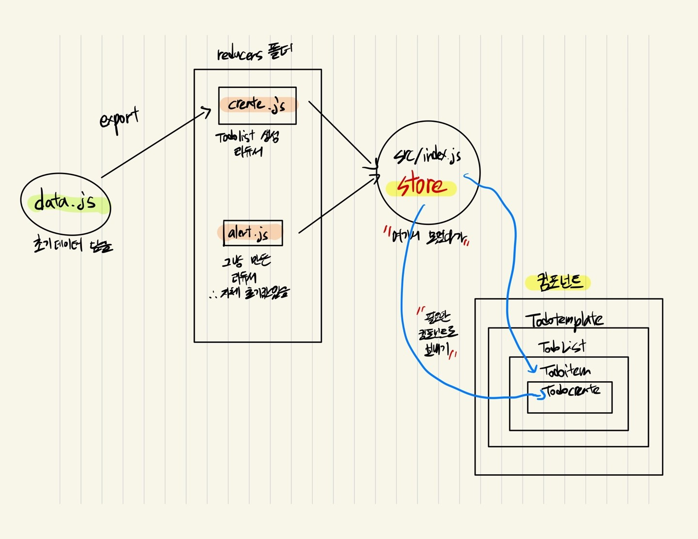
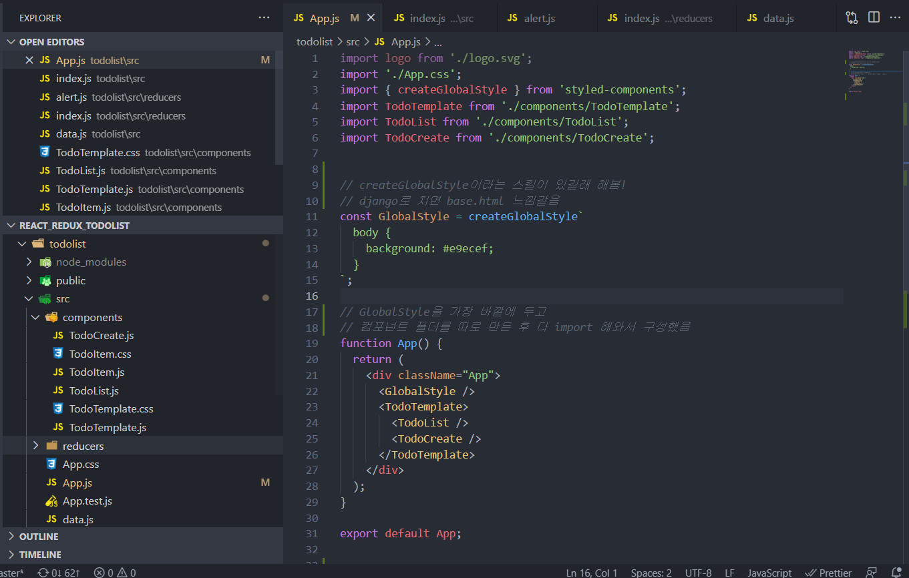
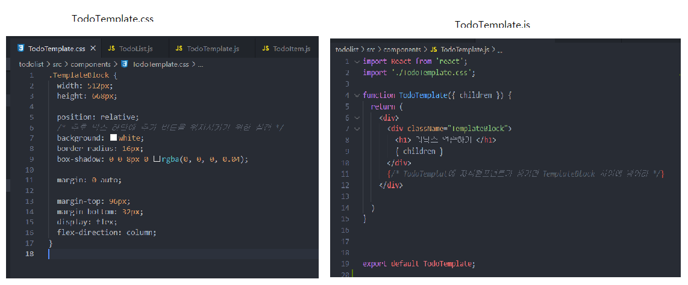
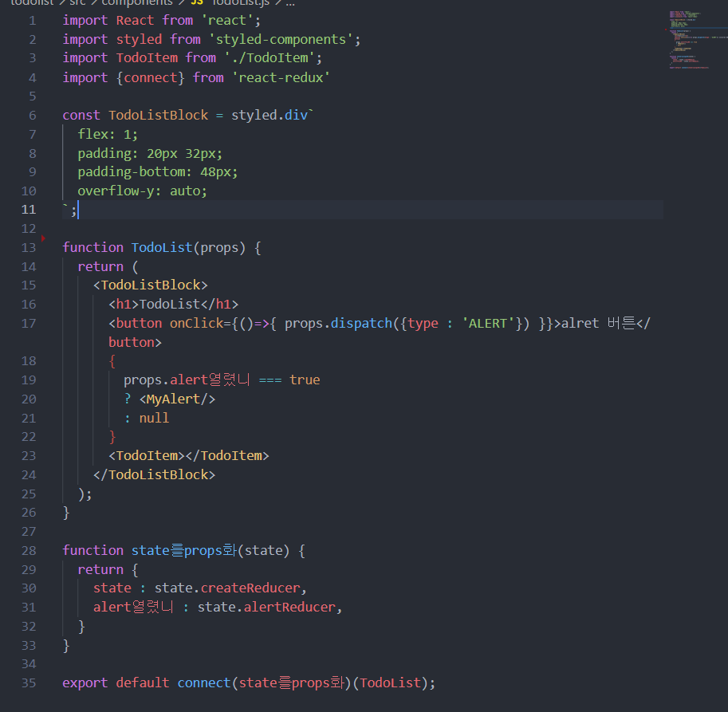
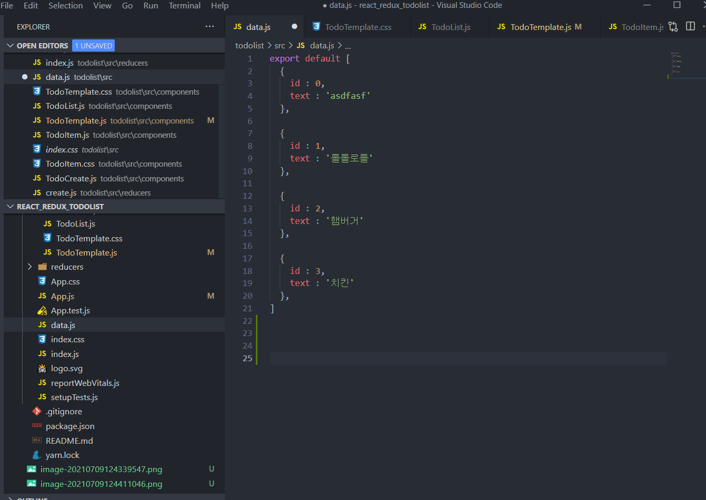
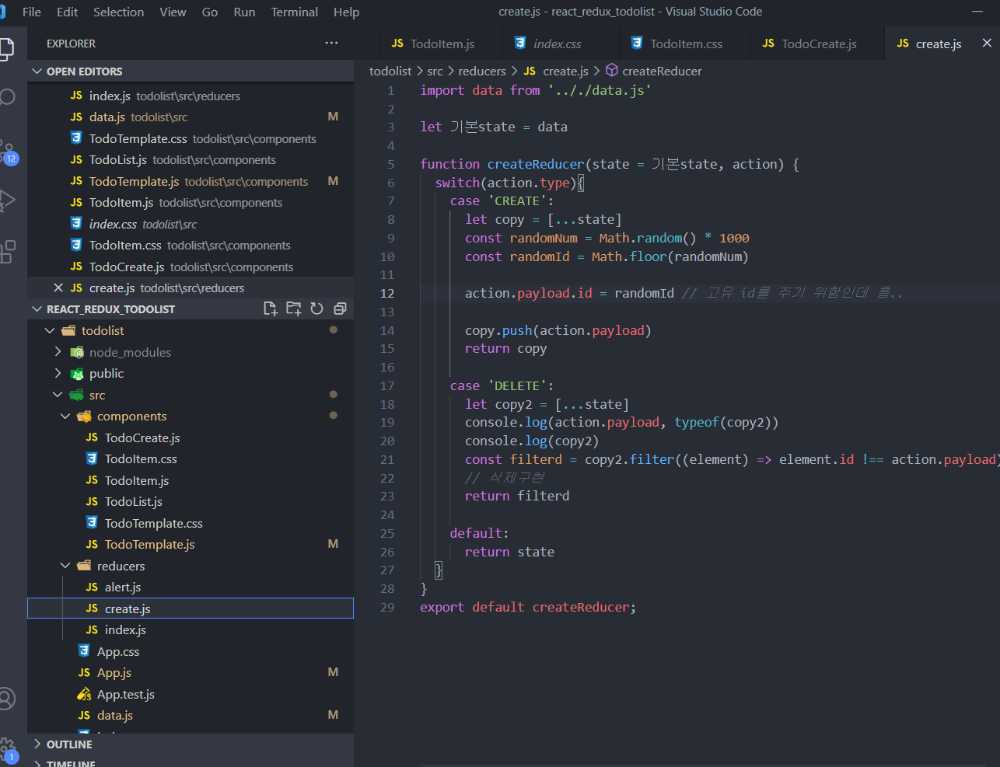
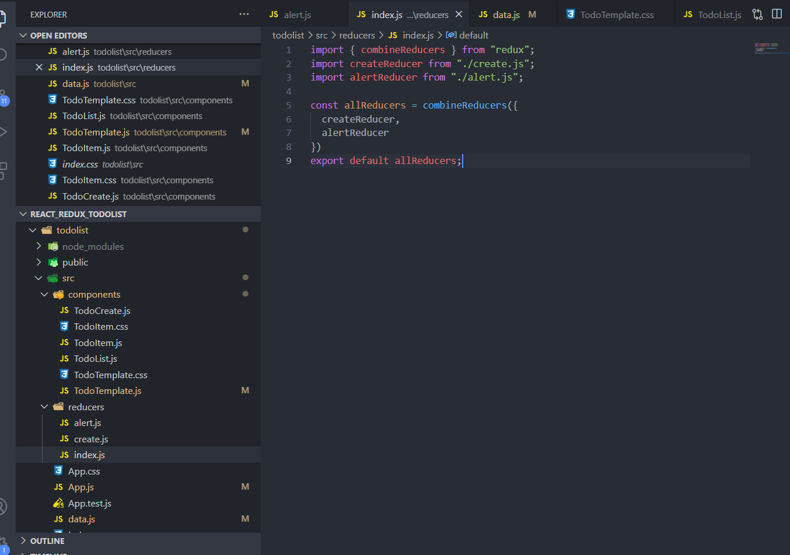
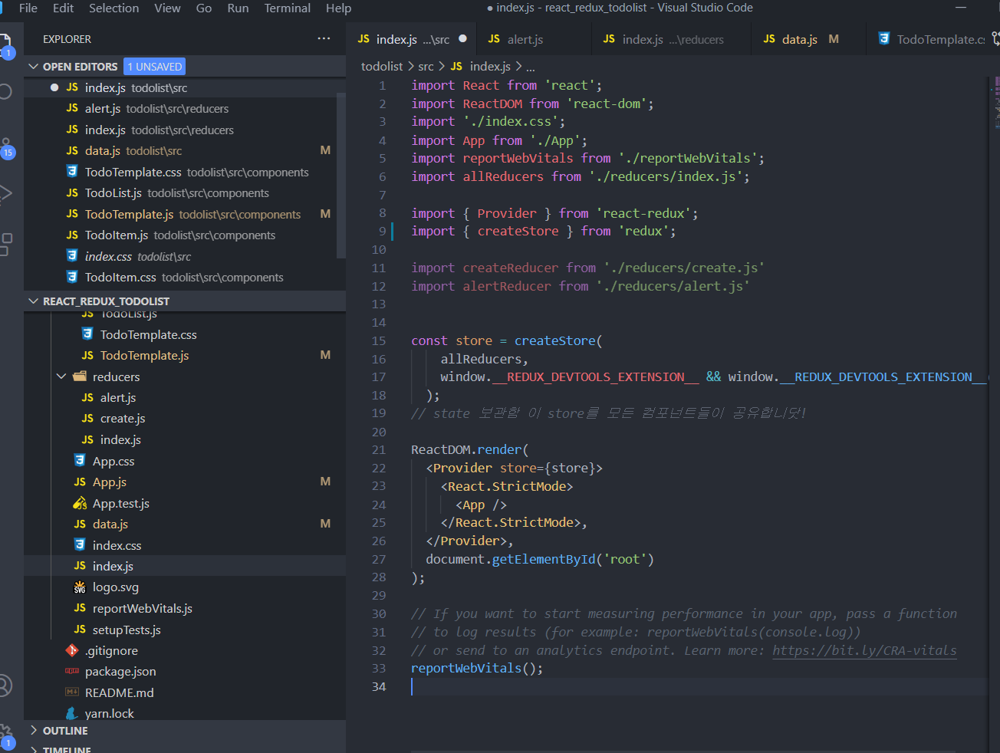
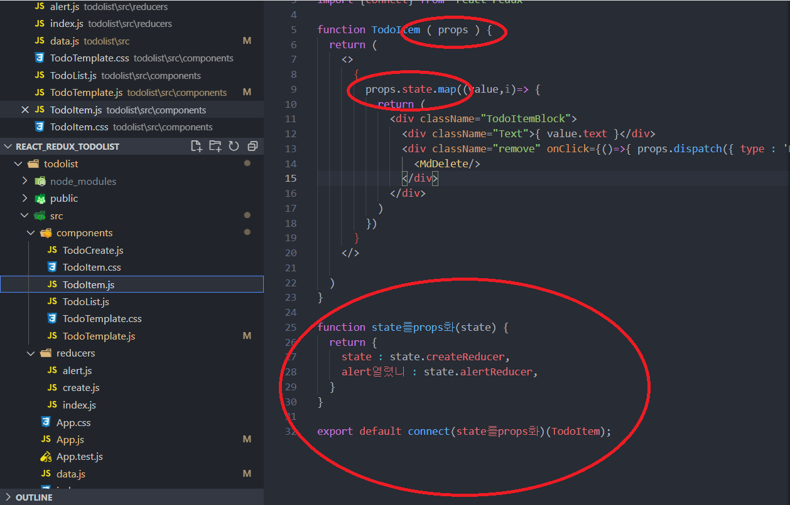
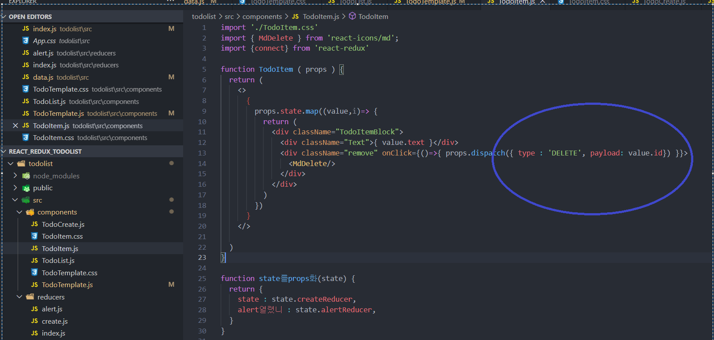

# Redux 최종 정리


## Redux 왜씀??

- 설치 : yarn add redux react-redux
- 컴포넌트 많아지면 props 힘들어지니깐 props없이 쓰려고!
  1. Provider import 해오기
  2. 내가 state값 공유를 원하는 컴포넌트를 다 감싸기
     - 그러면 해당 컴포넌트와 그 안에 있는 모든 HTML, 컴포넌트들은 전부 state를 직접! props전송 없이 사용가능함
  3. redux에서 state를 하나 만드려면 createStore()함수 사용
  4. Provider에 만든 state를 props처럼 state이름={state이름} 해주면됨
  5. 원하는 컴포넌트.js밑에 connect()를 통한 function하나를 만들어줌
  6. props가져오고 props.블라블라로 데이터 바인딩 가능!


참조 : https://react.vlpt.us/redux/07-implement-todos.html


## 액션(Action)

상태에 어떠한 변화가 필요하게 될 때, 우리는 액션이란 것을 발생시킨다. 이는, 하나의 객체로 표현되는데, 액션 객체는 다음과 같은 형식으로 이뤄져 있다.

다른 것들은 선택사항이지만 type은 반드시!! 들어가야 한다.

```react
{
    type : "ADD_TODO",
    data : {
        id : 0,
        text : "리덕스 배우기"
    }
}
```


## 액션 생성함수 (Action Creator)

액션을 만드는 함수이다. 파라미터를 받아와서 액션 객체 형태로 만들어준다. 보통 함수 앞에 export 키워드를 붙여서 자연스럽게 다른 파일에서 불러서 사용할 수 있도록 한다.

액션을 발생시킬 때 짧은 함수들은 굳이 액션생성함수를 정의해서 사용할 필요는 없다.

actions 폴더 안에 index.js를 만들어 한번에 모아서 보관한다! 마치 CSS처럼?

```react
export const increment = (nr) => {
  return {
    type: 'INCREMENT',
    payload: nr
  };
};
export const decrement = () => {
  return {
    type: 'DECREMENT'
  };
};
```


## 리듀서 (Reducer)

변화를 일으키는 함수이다. 리듀서는 두가지의 파라미터를 받아온다. 

reducers라는 폴더에 원하는 리듀서파일 모두 만든다음 index.js라는 파일 또 만들고 한번에 취합해서 export 해준다.

```react
const counterReducer = (state = 0, action) => {
  switch(action.type){
    case 'INCREMENT':     // 액션생성함수에서 정의한 변수명
      return state + action.payload;
    case 'DECREMENT':
      return state - 1;
    default:       // switch쓸꺼면 default 꼭 정해줘야함!
      return state;
  }
}
export default counterReducer;
```


## 스토어

리덕스에서는 한 애플리케이션 당 하나! 의 스토어를 만든다. 스토어 안에는, 현재의 앱 상태와, 리듀서가 들어가있고, 추가적으로 몇가지 내장함수들이 들어가있다 (일종의 독립된 데이터센터?)


## 디스패치 (dispatch)

액션을 발생 시키는 내장함수! dispatch(action)과 같은 형식으로 액션을 파라미터로 전달한다. 이렇게 호출을 하면 스토어는 리듀서 함수를 실행시켜 해당 액션을 처리하고 state를 업데이트한다.


## Redux로 TodoList만들기 연습

### 0. 간략 구성 흐름도



### 1. 컴포넌트 구성

- 컴포넌트는 따로 폴더를 만들어서 각각 만든후 export해놓음



- 컴포넌트에 css입히는 방식이 2가진데

  - 첫째로 TodoTemplate.js와 TodoTemplate.css를 따로 만들어서 구성하는 방법

    - TodoTemplate.css & TodoTemplate.css 
    - js 파일에서 css파일을 import해오면 됨 import 겁나 많이함 react..

    

  - 둘째로 styled-components를 이용하여 한 js파일에서 처리하는 방법
    - 더 깔끔하긴 한데 css자동완성이 안됨... ㅎ

  


### 2. data & reducer구성

- 초기값이 되는 data파일을 아래와 같이 따로 만들었음



- reducer들만 모아둔 폴더도 따로 만들고 원하는 reducer 생성 

  - 만들어둔 data파일이 필요한 reducer.js에서는 data 또폴트 해오기
  - store에 변화를 일으키는 친구들임

  

- 곧바로 스토어에 보내면 난잡해지니깐 reducers폴더 안에 index.js를 따로 만들고 거기서 모아서 한번에 allReducers라는 이름으로 export (combineReducers 사용해야함)
- 

- src/index.js를 보면 store라는 친구안에 allReducers가 들어와 있는걸 볼 수 있음 여기가 우리가 다룰 데이터들이 총 집결해 있는 곳이라고 생각하면 됨!
- 


### 3. 컴포넌트에서 store 사용하기

- store로 다 모아놓은 data들을 각각의 컴포넌트에서 사용하려면 특정설정을 해야함
  - 아래의 빨간 원으로 표시된 설정을 추가해줌
  - 원하는 컴포넌트마다 설정해주면 됨
    1. 25번째줄에 state라는 매개변수로 우리가 설정해놓은 모든 store가 넘어온 후
    2. 우리에겐 reducer가 createReducer, alertReducer 2 가지가 있으니 따로따로 저장
    3. props.state 혹은 props.alert열렸니 로 컴포넌트에서 사용가능




- 컴포넌트에서 reducer로 데이터수정요청 보내기
  - dispatch라는 함수를 사용해서 reducer로 요청을 보낼 수 있음 
  - type : 'DELETE' 에 해당되는 reducer함수가 실행됨
  - payload : 배송품? 이라고 생각하면 됨 reducer함수에 전달되는 정보



- 초록색 원의 case 'DELETE': 라는 부분의 함수가 실행 될 것이고
- 주황색원의 actin.payload가 우리가 보낸 데이터임
- 이는 5번째줄에 두번째 인자를 action이라고 이름지어서 받아와서임 만약에 이걸 '액션'이라고 지었으면 액션.payload가 우리가 보낸 데이터


Redux는 위와 같은 방식으로 계속 순회함


## 보완할 점

- javascript, css 공부 절실....

