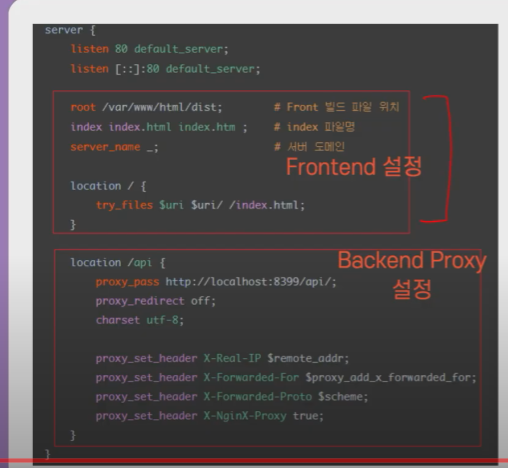
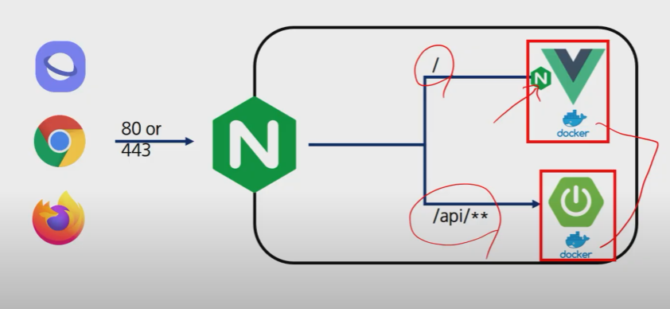

80 or 443 : http, https를 의미하는 약속된 port

/ 로 들어오는 요청은 프론트엔드의 라우터로

/api로 들어오는 요청은 벡엔드로 보내면서

FE, BE를 분기한다

##### 80 or 443 같이 약속된 포트를 안쓰면!

(SKT, KT, LGU)에 따라서 닫혀 있는 포트가 존재함!!

어느 곳에서는 되고, 어느곳 에서는 안될 수 있음!

ex) 멀티캠퍼스에선 투섬플레이스코리아(포트 7009 사용함) 가 안들어가짐..!

##### nginx

##### 배포구조

##### 왜 docker?

1. 빠르게 필요한 서버 증설 가능
2. 기존에는 VM을 증설하는 방식을 사용했음
3. VM이 부팅되는 1분이면 서비스 전체가 중지되기에 충분한 시간
4. 운영체제를 부팅해야하는 기존의 방식보다 빠름
5. 이미지를 만들어두면 찍어내기만 하면 되는 배포의 편의성(W / k8s) 
   - (java 버전을 잘못 깔았어요. node가 이 버전이 아닌데 ? 와 같은 상황 자신이 설정해놓은 세팅대로 배포 가능)
   - k8s : 쿠버네티스

##### 어디까지 도커화 해야 할까 ?

1. FE / BE는 필수적
2. 배포의 효율성/편의성을 생각해보자
3. DB / Jenkin / nginx는 선택적
4. DB를 이미지화해서 새로 배포할 일이 많이 있을까 ? 옮긴다면 데이터는 ?
5. 빌드 서버를 병렬적으로 추가 증설하는 경우는 ?

##### SSAFY GIT에서 Jenkins로 

1. 개발자가 gitlab 특정 브랜치에 머지를 하면 이벤트가 트리거되어 Jenkins에서 빌드를 시작한다.
2. 빌드가 완료되면 도커 이미지가 제작되어 배포된다.
3. 동일한 도커 이미지로 제작, 배포되기 때문에 동일성이 보장된다.

