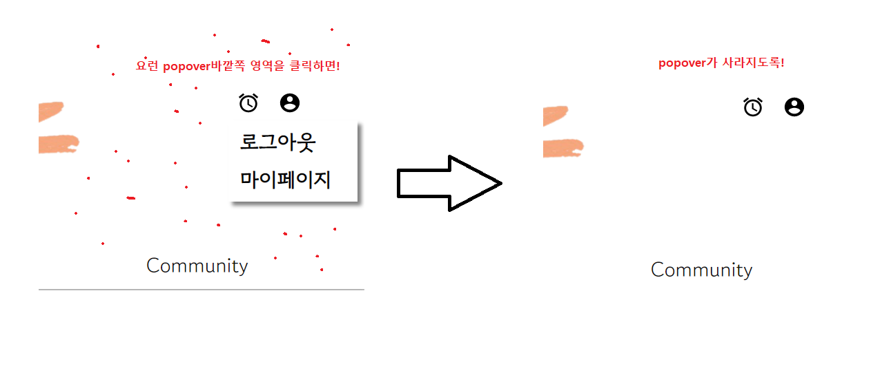
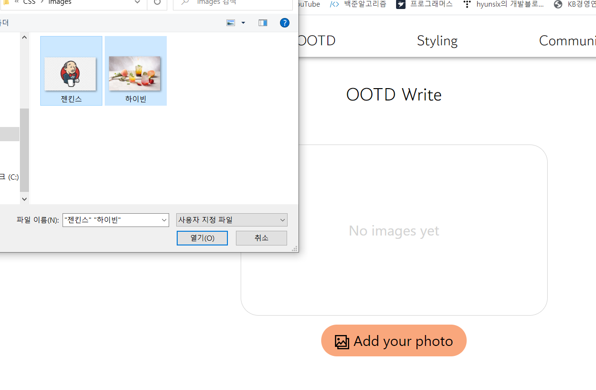
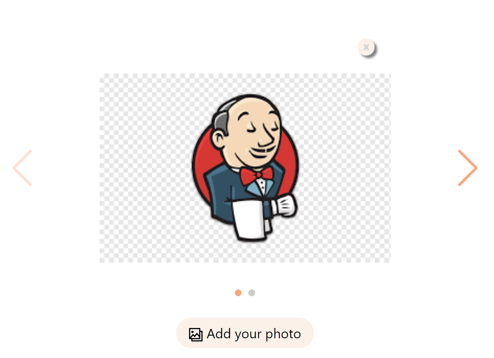
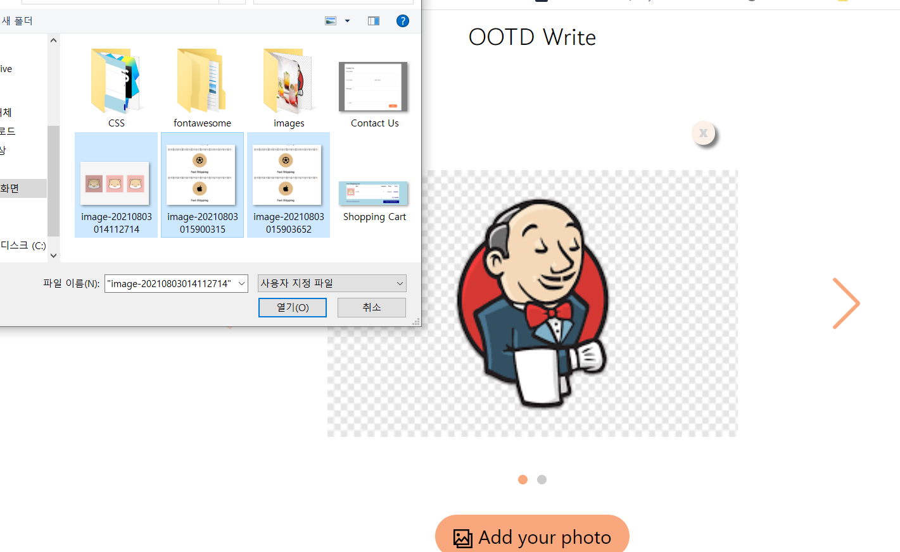
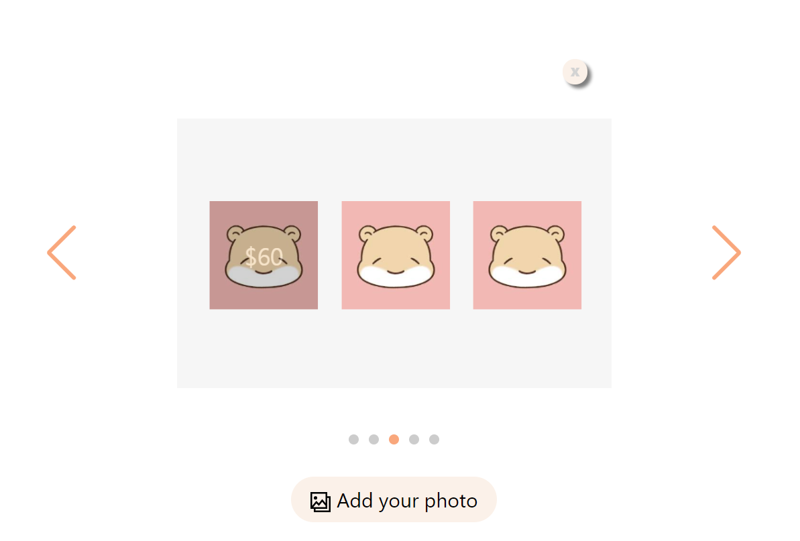

## Clikc Outside

##### 내가 하고싶은거



##### javascript스럽게 짜기

```react
// 함수part
const [popover, setpopover] = useState(false);

const openPopover = () => {
    setpopover(!popover);
};

useEffect(() => {
  document.addEventListener('mousedown', event => {
    if (!event.target) {
      setpopover(false);
    }
  });
});      
// ㅇㅇ? 이렇게 간단하다고 ? but document 들어가는 부분이 거슬림..


// HTML part
<MdAccountCircle className="mypage" onClick={openPopover} />

{popover ? (
    <div className="navbar-popover-box">
        <p>로그아웃</p>
        <Link to="mypage">
            <p>마이페이지</p>
        </Link>
    </div>
) : null}
```


##### react스럽게 짜기

```react
// 함수part
const [popover, setpopover] = useState(false);

const openPopover = () => {
    setpopover(!popover);
};

useEffect(() => {
  document.addEventListener('mousedown', () => {
    setpopover(false);
  });                       // ㅇㅇ? 이렇게 간단하다고 ? but document 들어가는 부분이 거슬림..
});


// HTML part
<MdAccountCircle className="mypage" onClick={openPopover} />

{popover ? (
    <div className="navbar-popover-box">
        <p>로그아웃</p>
        <Link to="mypage">
            <p>마이페이지</p>
        </Link>
    </div>
) : null}
```


## Image 여러개 업로드 + 미리보기











```react
// 함수파트

const [myImage, setMyImage] = useState([]);

const addImage = e => {
  const nowSelectImageList = e.target.files;   // 한번에 받은 파일리스트 (object임)
  const nowImageURLList = [...myImage];    // 현재 myImage 복사하고
  for (let i = 0; i < nowSelectImageList.length; i += 1) {
      // nowSelectImageList object를 i를 이용해서 돌리면서
    const nowImageUrl = URL.createObjectURL(nowSelectImageList[i]);
      // 미리보기 가능하게 변수화
    nowImageURLList.push(nowImageUrl);
      // 복사한 myImage에 추가
  }
  setMyImage(nowImageURLList);
    // MyImage원본에 덮어씌우기
};


// HTML 파트

<div>
  <label
    htmlFor="input-file"
    className="OOTDWrite-input-file"
    onChange={addImage}
  >
    <GrGallery />
    Add your photo
    <input
      type="file"    // input type file
      multiple="multiple"  // 여러개 가능!
      id="input-file"  // 커스텀 디자인하고 싶어서 라벨링
      style={{ display: 'none' }}
      accept=".jpg,.jpeg,.png"
    />
  </label>
</div>


// css 파트

.OOTDWrite-input-file {
  margin-top: 10px;
  padding: 6px 15px;
  background-color: var(--main-color-2);
  border-radius: 20px;
  color: black;
  cursor: pointer;
  margin-bottom: 30px;
}
```

