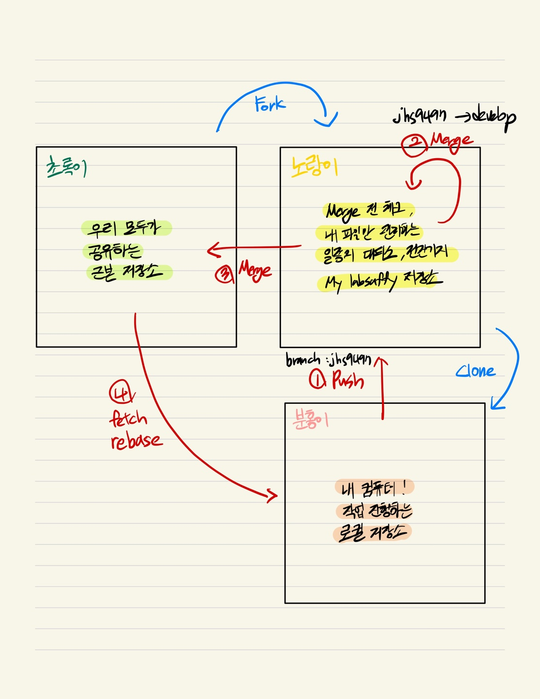
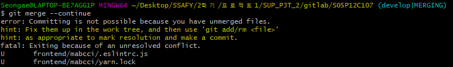

## gitlab conflict 해결법

**conflict가 일어나는 이유 :** 

merge 과정에서 파일의 이름이 같으면 충돌이 발생한다.
파일이 다르면 무조건 자동으로 합쳐준다.
파일이 같아도 수정한 부분이 다르다면 자동으로 합쳐준다.
(버전관리를 사용하는 정말 중요한 이유중의 하나)
근데 파일이 같고, 수정한 부분이 같다면 충돌이 발생한다.

0. 아래처럼 Resolve conflicts가 있다면 그냥 저기 들어가서 해결해버리면 됨! 근데 이유는 모르겠지만 Merge locally만 활성화 되어 있었음.. 그래서 로컬에서 직접 해결을 해줘야함

1. 방법은 2가지임
   1. 내 로컬 저장소에 merge하고 싶은 gitlab을 **rebase** 해오고 로컬에서 충돌 해결하는 법
      - 내가 원하는 commit을 base로 해서 내 브랜치가 마치 그 커밋에서 딴 것처럼 기록을 조작하고 .. 블라블라 장점은 merge를 위한 commit기록이 안남아서 깔끔한 commit관리 가능! but 머리 아픔
   2. 내 로컬 저장소에 merge하고 싶은 gitlab을 **pull** 해오고 로컬에서 충돌 해결하는 법
      - merge만을 위한 commit이 생겨서 깔끔하지 않다고 한다. 하지만 내 기준에서 조금 더 직관적이라 이 친구로 진행하기로 결정!

참고 블로그 : https://velog.io/@ha0kim/GIT-conflict-%EC%8B%9C-%ED%95%B4%EA%B2%B0%ED%95%98%EB%8A%94-%EB%B0%A9%EB%B2%95

2. 우선 현재 우리의 git flow상태는 아래와 같음

   1. 분홍색 내 로컬에서 branch 따로 파서 노란색 저장소에 push
   2. 노란색 저장소에서 devlop으로 merge 후 이상 체크

   3. jhs9497 -> develop 로의 merge 진행
   4. 모두가 공유하는 근본 저장소로 merge 진행
   5. 모두의 코드가 반영되어 있는 근본 저장소 버전으로 내 로컬 업데이트 해주기

   

3. 그런데 3번과정에서 문제가 생긴거임!
4. 그러므로 4번을 진행해서 현재 나의 로컬코드랑 근본 저장소 코드가 뭐가 충돌났는지 확인해야함!
5. git remote add upstream '근본 저장소 URL'
   - 만약 이미 등록되어 있다면 굳이 할 필요 X
6. git checkout develop
   - 내 로컬 브랜치 develop으로 변경해주기 (여기가 메인이니깐! )
7. git pull upstream develop 
   - 두려워하지말고 그냥 pull!!!!!!!!!! 그러고 vscode 켜보면 아래와 같은 에러를 확인할 수 있음

8. 코드가 길어서 짤렸는데 아래에 보면 Accept Incoming Change라고 해서 다른 색으로 칠해진 부분이 있음!

9. 빨간색 박스 or 파란색 박스를 클릭하면 conflict가 해결됨을 확인할 수 있음

10. git merge --continue
    - === 나 conflict 해결했으니깐 merge 하던거 마저 진행해줘 라는 뜻
    
    
    
    
    
    - 만약 git merge --continue 했는데 위와 같은 에러가 뜬다면
    
      - git commit -am "커밋메세지"
      - git push upstream develop
    
      
    
11. gitlab 다시 돌아가면 그토록 보고 싶었던 초록색 Merge 버튼 나와있는거 볼 수 있음! 

    or git push upstream develop 했다면 그냥 잘 합쳐져 있을거임!

12. conflict가 아닌 일반적으로 merge가 잘 된 경우면 근본 저장소 -> 로컬 업데이트 진행해주기 why? 그 사이에 다른 팀원들이 근본 저장소에 뭔가 merge했을 수 도 있으니깐!

13. update
    - git fetch upstream // 정보 반영
    - git checkout develop (만약 안되어 있다면)
    - git branch -D jhs9497 
    - git rebase upstream/develop (이게 업데이트)
    - git checkout -b jhs9497 (요 지웠다 다시 생성하는브랜치 작업은 약간 혹시나 하는 충돌 우려때문에 하는 것! )
    - 충돌난다면 git rebase --continue

jhs9497 / develop

develop 원격저장소 pull 받아왔습니다

jhs9497 -> develop merge하는 명령어

develop 브랜치에서 git merge jhs9497 실행