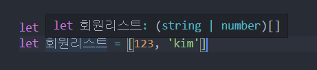

## Why TypeScript?

javaScript는 Dynamic Typing이 가능하다

- 그 뜻은 예를 들어 10 + '10'을 해줬을 때 스트링형인 '10'을 javascript가 자동적으로 숫자 10으로 바꿔서 10 + '10'을 20으로 만들어준다는 뜻이다. 
- 엄격한 type 지정이 가능하므로 프로젝트가 큰 경우 많이 사용한다.
- 에러메세지가 친절함!


## 프로젝트에 TypeScript 적용하기

- 일반 HTML CSS JS 웹개발 시

  - npm install -g typescript

  - 작업폴더에 .ts로 끝나는 파일 만들고 사용 시작

  - 근데 웹브라우저는 ts 파일을 알아듣지 못하기 때문에 js파일로 변환 작업을 해야한다.

  - js 파일로 변환하기 위해 Terminal 창에 tsc -w 입력 -> 자동으로 js파일로 변환해줌

    - tsc -w 입력했는데 이 시스템에서 시스템 사용 어쩌구 보안 어쩌구 에러메세지 나오면!

      1. windows PowerShell 프로그램을 관리자 권한으로 실행합니다.
      2. **Get-ExecutionPolicy** 명령어를 작성하면 본인의 권한? 상태가 보여집니다.
      3. 권한이 RemoteSigned 가 아니라면 **Set-ExecutionPolicy RemoteSigned** 를 입력
      4. 모두 예
      5. **Get-ExecutionPolicy** 명령어로 다시 한번 확인 하면 RemoteSigned로 변경 확인.
      6. 끝!

      

  - 변환된 .js 파일에 코딩 하기

- React로 웹개발 시

  - 이미 있는 React 프로젝트라면 ?
    - npm install --save typescript @types/node @types/react @types/react-dom @types/jest
  - New React 프로젝트라면 ?
    - npx create-react-app my-app --template typescript

## tsconfig 파일 생성하기

프로젝트 폴더에 tsconfig.json 이라는 파일 생성

여기엔 타입스크립트 ts 파일들을 .js 파일로 변환할 때 어떻게 변환할 것인지 세부설정이 가능

리액트나 뷰 이런거 쓰는 중이면 이미 있을 수 있음

```javascript
{
    "compilerOptions": {
        "target": "es5",  // 어떤 버전의 자바스크립트로 바꿔줄지 정하는 부분 신버전을 원하면 es2016, esnext 이런것 입력
        "module": "commonjs",
        "strictNullChekcs": true // null, undefined 타입에 이상한 조작하면 에러 띄우는 설정
    }
}

// 어느정도 IE 호환성을 원하면 es5, commonjs가 국룰인데 이제 IE 서비스종료했으니 es최신버전 사용해도 될 듯
```


## TypeScript 기본연습

```typescript
let 이름 :string = 'kim';
// 이 변수엔 string(문자)만 들어올 수 있다!

let 어레이 :string[] = ['kim', 'park']
// 이 배열엔 문자형만 들어올 수 있다!

let 이름or숫자 :string | number = 123;
이름or숫자 = '문자'
// 이 배열엔 문자 or 숫자형 가능

type MyType = string | number;
// 타입의 변수화

let 타입변수화 :MyType = '타입은 보통 대문자로 명명함'
// 타입 변수로 먹이기 가능

function 함수(x :number) :number{ // 오른쪽 타입은 어떤 타입으로 리턴되는지 정의
  return x * 2
}

type Member = [number, boolean]; // 어레이에서 무조건 첫 째는 number, 둘 째는 boolean값이 들어와야함
let john:Member = [122, true]


// 객체에 key 값은 무조건 string, value값도 string으로 들어와야 한다!
type MemberObj = {
  [key :string] : string,
}

let hyunsix : MemberObj = { name : '현식', gender : 'Man'}
```


## TypeScript 기본 타입 정리

- string
- number
- boolean
- null
- undefined

```typescript
let 연습 :string = 'kim';
let 나이 :number = 50;
let 결혼유무 :boolean = false;

let users :string[]= ['jo', 'yun']
let info :{member1 : string} = {member1 : 'kim'}

let project: {member :string[], days: number, started : boolean} = {
  member : ['kim', 'park'],
  days : 30,
  started : true,
}

```

#### 근데 사실 타입스크립트는 변수 선언함과 동시에 자동으로 type지정해줌




## 타입 미리 정하기 어려울 때

```typescript
// Union type
let 음식 :(number | string) = 'kim';

// array 안에 문자, 숫자 들어올 수 있다
let 음식들 :(number | string)[] = [1,2,'햄버거']

// number or string으로 이루어진 array 들어온다는 뜻
let 소괄호안치면 :number | string[] = 2

let 오브젝트 :{ a : string } = { a : '123'}

// any : 모든 type이 들어올 수 있음 but 그럼 TypeScript 쓰는 이유가 없긴함 
// 또한 any가 다른 변수에 할당될 때 그 변수의 type체크도 무효화 시켜버릴 수 있음
let 애니 :any;

애니 - 1
// 에러 안남

// unknown : any처럼 모든 type이 들어올 수 있지만 다른 변수에 들어갈 때 타입체크가 유효함
// 즉 unknown이 더 안정적임
let 언노운 :unknown = 123;

언노운 - 1
// 에러 남 


// 엄격한 typescript 체험하기

 let 숫자or문자 :string|number;
 숫자or문자 + 1;
 // Union으로 합친 type을 새로운 type으로 인지해서 에러뜸
 // only string이거나 only number만 연산 가능

 let 문자 :string = '1'
 문자 + 1
 // 에러 안남
```


## 함수에 Type 지정하기

```typescript
function 함수2(x :number) :number {
  return x * 2
}

함수2(3)


// 함수에서만 쓸 수 있는 void 타입
// return 하기 싫은 함수에서 쓰기!
// void는 텅 비었다는 뜻
// 실수로 return 넣을 시 에러 발생시킴
function 함수3 (x :number) :void{
  1 + 1
}

함수3(10)

// 파라미터 무조건 넣어야 에러 안나는데 파라미터를 옵션으로 주고 싶으면
// 파라미터 뒤에 ? 넣어주기 -> undefined가 들어올 수 있다는 뜻을 의미

function 함수4 (x? :number) :void{
  1 + 1
}

함수4()
```


## Narrowing

Union으로 이루어진 함수들 연산안될 때 if문 통해서 type별로 분기해 주는 것

```typescript
function 내함수(x : number|string) {
  if (typeof x === 'number') {
    return x + 1
  } else {
    return x + '1'
  }
  
}

내함수(123);


function 내함수2(x : number|string){
  let arr :number[] = [];
  if (typeof x === 'number') {
    arr[0] = x;
  } else {
    return
  }
}

내함수2(123);


// narrowing이 귀찮다 -> assertion (덮어 씌우기)

function 내함수3(x : number|string) {
  let array :number[] = [];
  array[0] = x as number; // 왼쪽에 있는 변수를 오른쪽 type으로 덮어씌워주세요
}

// as 문법의 용도
// 1. Narrowing 할 때 써야한다.
// 2. 무슨 타입이 들어올지 100% 확실할 때 써야한다. -> 사실상 ts 기능 상실하는거임
내함수3(555)
```


## Type 변수화 하기

#### 주의할점 : Type 재정의 불가능

```typescript
// type 변수, 대문자로 시작하는게 rule
type AnimalType = string | number | undefined;

let 동물 :AnimalType = '사자'
동물 = 2
동물 = undefined
// 다 됨!


// 타입스크립트에서는 object안의 value값도 control 가능
// readonly 쓰면 value값 수정 불가능(은 아니고 에러만 띄워줌! .js가면 수정은 되어있음 ㅎㅎ)
type Girlfriend = {
  readonly name : string
}

const 여친 :Girlfriend = {
  name : '미진'
}


// type 합치기
type Name = string;
type Age = number;
type Person = Name | Age

type PositionX = { x : number };
type PositionY = { y : number };
type NewPosition = PositionX & PositionY 
// {x : number, y : number}로 extend 한 것!

let position :NewPosition = { x : 10, y : 20}
```


## React + TypeScript 사용할 때 알아야할 점

 

설치: npx create-react-app my-app --template typescript

```typescript
import React, { useState } from 'react';
import './App.css';

let 박스 :JSX.Element = <div>asdfasdf</div>;
// HTML을 변수에 담을 때

function App() {

  let [user, setUser] = useState('kim')
  // useState할 때는 useState안에 있는 type을 기준으로 자동으로 type지정 됨!

  let [굳이, set굳이] = useState<string | number>('jo')
  // 근데 굳이 초기에 넣어준 type외에 다른 것도 받을 수 있게 하고 싶으면 이렇게 타입을 넣어주면됨!

  return (
    <div>
      { 박스 }
      <h4>안녕하십니까</h4>
      <Profile name="철수"/>
    </div>
  );
}

// props로 받는 친구는 항상 object로 넘어옴 그러므로 object 타입지정을 해줘야함
function Profile(props :{[key :string]: string}) :JSX.Element{ // return할 친구 type지정
  return (
    <div>
      프로필입니다.
      {props.name}입니다
    </div>
  )
}

export default App;
```

