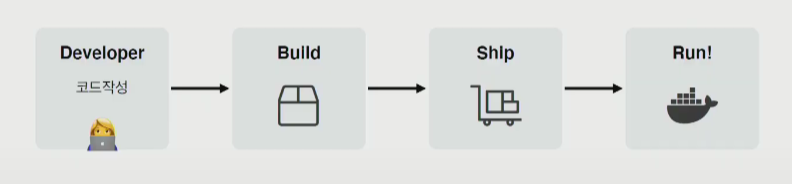
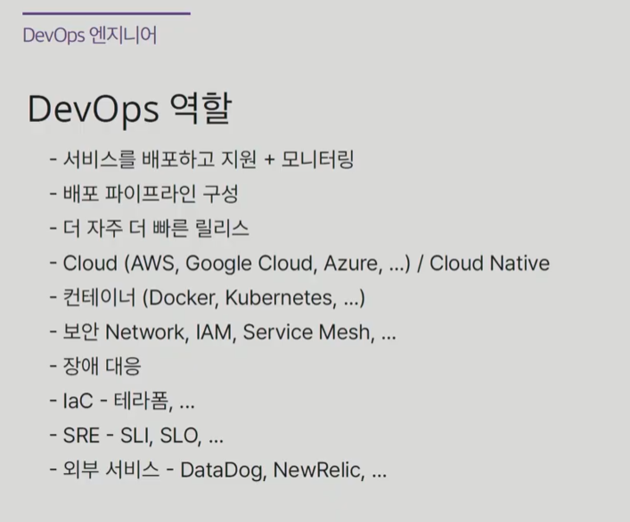
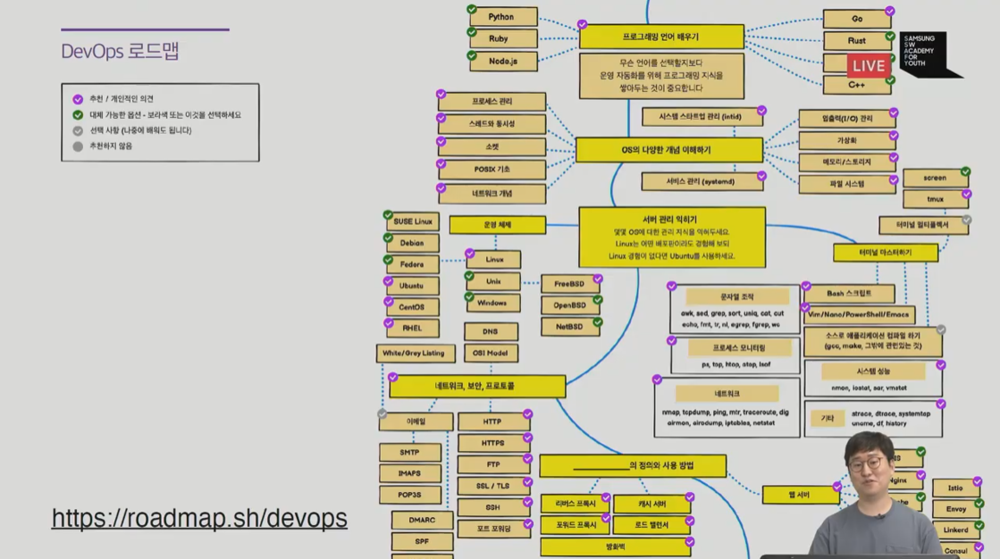

## 도커와 쿠버네티스 활용

## 1. 서버를 관리한다는 것

🔼서버의 상태를 관리하기 위한 노오오력

#### node.js로 관리한다면

1. 명령어 까먹으면 난감해짐
2. 버전 변경이 쉽지 않음 불안함!
3. 전임자가 잠수타면 망할 수 있음..!

- PaaS 

  - 깃헙과 연동하여 굉장히 쉽게 배포가 가능함! 필요한 설정이 자동 구축되어 있음
  - 너무 쉽다,,,
  - 사용자가 많아지면 사용자의 접속량에 따라서 서버도 확장해줌 ㄷㄷ
  - 애플리케이션을 PaaS 방식에 맞게 작성해야하는 단점 존재
  - 서버에 대한 원격 접속 시스템이 없어서 접근이 불가능
  - 배포는 너무 쉽지만 연동이 불가능한 세부 기능들이 꽤 있음!

  

## 2. 도커와 쿠버네티스의 등장

이 등장을 통해 서버관리/개발 방식이 완전히 바뀌게 됨!

docker compose up 명령어를 통해

mysql, mongoDB, chat 등 다 실행 가능!

또한 오픈소스이기 때문에 AWS, 구글클라우드, 네이버클라우드 등 어디서든 돌릴 수 있다!

- 가상머신처럼 **독립적으로 실행**되지만
- 가상머신보다 **빠르고, 쉽고, 효율적**이다

why? 가상머신은 overhead된다면 도커는 격리하는 느낌이기 때문!

- 클라우드 이미지가 보다 관리하기 쉬움
- 다른 프로세스와 격리되어 가상머신처럼 사용하지만 성능저하 (거의)없음
- 복잡한 기술을 몰라도 사용 가능
- 오픈소스 > 특정 회사 기술에 종속적이지 않음

서버를 관리하는게 아래 그림처럼 단순화됨!

근데 배포는 어떻게 할까 ????

예를 들어 서버가 3대 (컨테이너가 3개)가 있으면 하나하나 다 접속해서 배포하기 귀찮..!

그리고 서버가 많아지면 어떤 서버가 여유있는지 등 관리하기가 어려움

#### --> 컨테이너 오케스트레이션 등장

- 컨테이너를 하나의 클러스터로 묶음
- 개별 컨테이너 상태관리 기능
- 그 중 **kubernetes**란 컨테이너 오케스트레이션이 가장 많이 이용됨!

## 3. 배포 프로세스 개선하기

## 4. DevOps 엔지니어

