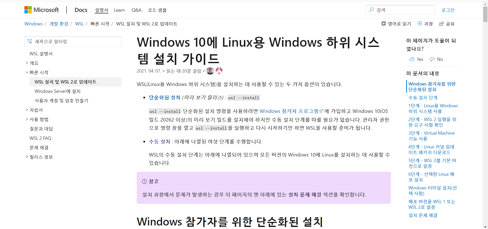
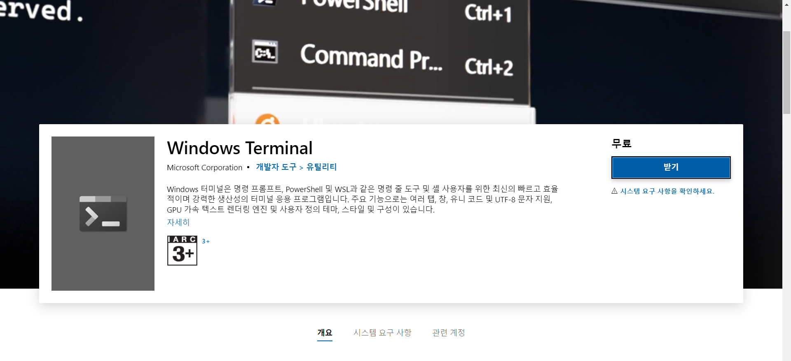
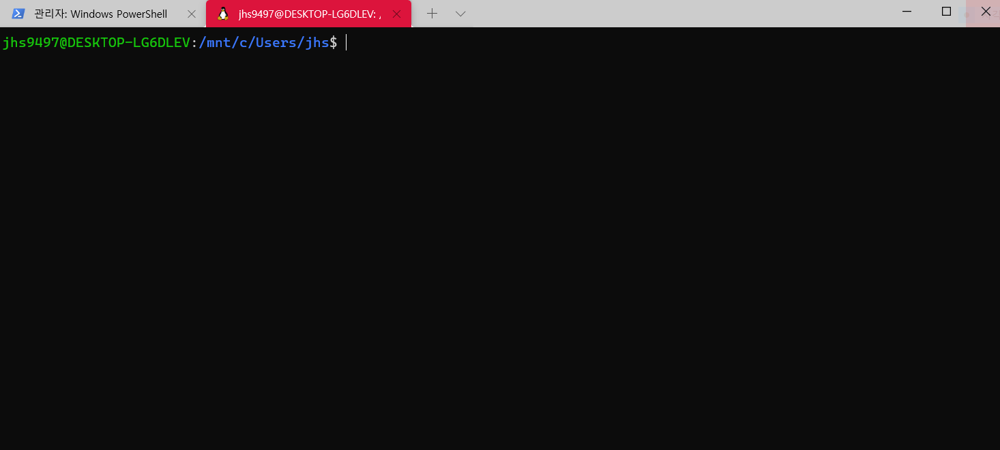

## 리눅스란 ?

윈도우와 같은 OS 중 하나이며 오픈소스로 현재도 계속 성장하고 있다. 리눅스는 서버, 모바일, PC 환경 등 다양하게 사용되고 있으며 서버 환경에서 개발을 진행하는데 용이한 장점이 있다.

따라서 개발자에겐 리눅스가 개발환경이든, 배포, 운영환경에서든 연관될 경우가 많기에 친해져야 하는 OS라고 볼 수 있다. 

## 우분투란?

우분투는 현재 개인용 데스크톱 환경에서도 가장 인기 있는 리눅스 배포판입니다. 데비안 리눅스를 기반으로 개발되며, 데비안에 비해 사용 편의성에 초점을 맞춘 리눅스 배포판이다.

## WSL2란?

윈도우 10을 사용하고 있는 환경이라면 몇가지 설정만으로 윈도우 내에서 또 하나의 작은 시스템으로 WSL을 사용할 수 있다. MS 공식문서에서 나오는 설치 방법을 그대로 따라하면 매우 빠르게 리눅스 환경을 구축할 수 있다. 

효율성을 위하여 WSL2 방식으로 리눅스 환경을 구현하기로 판단하였다!

## 진행과정

구글에 wsl2를 검색하여 공식문서를 확인한다.

window terminal도 설치해보자

window terminal을 통해 우분투 실행

