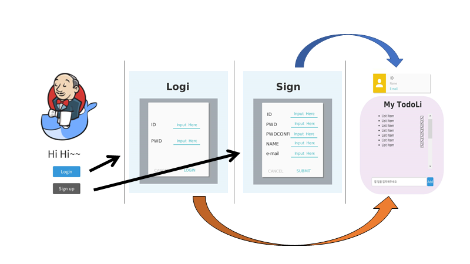
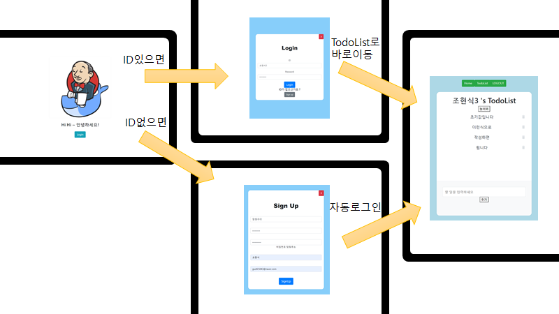

## React를 통한 회원가입/로그인/TodoList 만들기


## 1. UI 및 UX 설계

- 피그마를 사용할까 하다가 빠르게 구현하고자 카카오 오븐을 통해 만들었다.
- 글자들이 좀 짤린 부분이 있는 것 같은데 이제 봤네...
- 다음번에는 현업에서 더 자주 사용된다고 하는 피그마를 사용할까 한다.



## 2. 실제 구현 / FE




#### 🤔어려웠던 점

1. 로그인 후 회원정보를 저장할 때 redux를 사용했었는데 redux는 새로고침하면 초기화된다는 치명적인 단점이 있었다. 예를 들어 로그인을 하게 되면 TodoList페이지에 <<조현식3>> 's TodoList이 부분에서 <<>> 가 userID로 설정을 해놓은 것인데 redux만을 이용해 유저정보를 저장하니 새로고침시 userID를 찾을 수 없는 상태가 되었다.

   - 💥해결방안으로 로컬스토리에도 유저정보를 저장하기로 하였다. 이를 통해 새로고침 후에도 로컬 스토리지에 담겨있는 유저정보를 가져옴으로써 오동작을 방지했다. 하지만 redux와 로컬스토리지 둘 다 사용하다 보니 코드가 조금 더러워져서 리팩토링 과정이 필요하다.

2. 서버에 회원가입이나 로그인 API를 axios 요청 보낼 때 CORS정책에 따른 에러메세지를 계속 확인 하게 되었다. CORS란 Cross-Origin Resource Sharing에 줄이말로, 직역하면 교차 출처 리소스 공유라고 해석할 수 있다. 교차출처는 '다른 출처'를 의미하는데 쉽게 말해서 현재 react와 다른 포트번호를 가진 django에 요청을 보내니깐 보안상의 이유로 에러를 내뿜는것이다. 

   - 💥해결방안으로 http-proxy-middleware setupProxy.js를 통한 설정을 이용하였다.

     1. yarn add http-proxy-middleware / npm install http-proxy-middleware 둘 중하나 ㄱㄱ

     2. src폴더 밑에 setupProxy.js파일 생성

     3. ```javascript
        	// 요런식으로 작성!
        
        const { createProxyMiddleware } = require('http-proxy-middleware');
        module.exports = function(app) {
          app.use(
            '/accounts/signup', 
            createProxyMiddleware({
              target: 'http://localhost:8000',
              changeOrigin: true,
            })
          );
        };
        ```

     4. axios요청 보낼때 app.use에 정의한 /accounts/signup'만 정의해주고 잘 사용하기!

        - 😂그러나 2가지 실수로 인해 굉장히 많은 시간이 더 소요되었다.
          - proxy문법이 신문법으로 수정된 것이 위와 같은데 버전상 문제로 신문법이 말을 안들음..!
          - axios를 여러 군데에 보내고 싶으면 app.use를 여러번 작성해야 하는데 대충 느낌으로 작성하니깐 형식이 맞지 않아서 계속 에러뜸!

     5. 결국 여기저기 알아보며 최종적으로 완성한 코드는 아래와 같다.

     ```javascript
     // setupProxy.js
     
     const proxy = require('http-proxy-middleware');
     module.exports = function(app) {
       app.use(
         proxy('/accounts/signin', {
           target: 'http://localhost:8000',
           changeOrigin: true,
         })
       );
       app.use(
         proxy('/auth/login', {
           target: 'http://localhost:8000',
           changeOrigin: true,
         })
       );
     };
     
     
     // axios 요청보낼 때 함수
     
     import axios from 'axios';
     
     function SignupOK(data) {
         const LOGIN_URL = 'auth/login'
         const userinfo = {
           username : data.username,
           password : data.password,
         }
         axios.post(LOGIN_URL, userinfo)
         .then((res) => {
           console.log(res)
         })
         .catch((err) => {
           console.log(err)
         })
       }
     ```

     


## 3. 실제 구현 / BE

😁

사실 백엔드는 그냥 회원가입/로그인 기능이 잘되나 테스트용도로 필요한 것이기 때문에 1학기 관통프로젝트에 있었던 django서버를 현재 sub 프로젝트 명세서에 맞게 api요청주소나 전달되는 data들을 조금 수정해서 사용하였다. 그래서 크게 어려운 점은 없었지만 돌이켜 보니 react에서 고생했던 CORS정책으로 인한 proxy설정을 사실 안해도 됐었다.. 왜냐면.... 그 작업을 django에서 해놨었기 때문......... 

```python
# settings.py

CORS_ORIGIN_ALLOW_ALL = False
CORS_ORIGIN_WHITELIST = (
    'http://localhost:8080', # vue의 포트번호
    'http://127.0.0.1:8000', # django의 포트번호
)

```

CORS_ORIGIN_ALLOW_ALL을 True로 바꾸어서 모든 요청을 다 CORS무시하고 받아들이겠다! 하던가CORS_ORIGIN_WHITELIST에 react의 포트번호를 추가하면 됐었는데 까마득히 까먹고 있었다가 창영님께서 알려주셨다bbbb 

이 참에 django에서 CORS 에러안뜨게 세팅하는 법을 정리하고 가자면

1. pip install django-cors-headers 설치

2. ```python
   # settings.py
   
   INSTALLED_APPS =[ 
       ... 
       'corsheaders', # CORS 관련 추가 
   ]
   
   
   MIDDLEWARE = [ 
       'corsheaders.middleware.CorsMiddleware', # CORS 관련 추가 (주의! 맨 위에 추가해야함!)
       ...
   ]
   
   CORS_ORIGIN_ALLOW_ALL = False
   CORS_ORIGIN_WHITELIST = (
       'http://localhost:8080', # vue의 포트번호
       'http://127.0.0.1:8000', # django의 포트번호
   )
   ```

끝!!


## 😏마무으리

생각보다 어려웠...다! ㅋㅋㅋㅋㅋㅋ 지난주동안 react를 나름 공부한다고 열심히 했다고 생각해서 금방 끝낼줄 알았는데 역시 세상일은 맘대로 되는게 아니었따ㅎ 

- javascript 보다 더 깊은 이해, 클린코드
- 우리 프로젝트가 앱적인 성격이 강하니 CSS 마스터가 되자 
- 코딩 좀 더 깔끔히 하자!

이런 생각을 가지며 프로젝트 끝!


