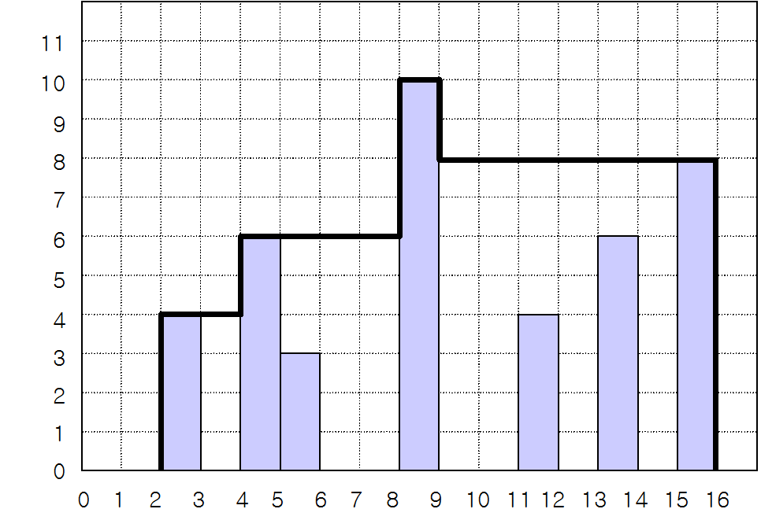

### 백준 2669. 직사각형 네개의 합집합의 면적 구하기


평면에 네 개의 직사각형이 놓여 있는데 그 밑변은 모두 가로축에 평행하다. 이 네 개의 직사각형들은 서로 떨어져 있을 수도 있고, 겹쳐 있을 수도 있고, 하나가 다른 하나를 포함할 수도 있으며, 변이나 꼭짓점이 겹칠 수도 있다.

이 직사각형들이 차지하는 면적을 구하는 프로그램을 작성하시오.


## 입력

입력은 네 줄이며, 각 줄은 직사각형의 위치를 나타내는 네 개의 정수로 주어진다. 첫 번째와 두 번째의 정수는 사각형의 왼쪽 아래 꼭짓점의 x좌표, y좌표이고 세 번째와 네 번째의 정수는 사각형의 오른쪽 위 꼭짓점의 x좌표, y좌표이다. 모든 x좌표와 y좌표는 1이상이고 100이하인 정수이다.

## 출력

첫 줄에 네개의 직사각형이 차지하는 면적을 출력한다.

## 예제 입력 1 복사

```
1 2 4 4
2 3 5 7
3 1 6 5
7 3 8 6
```

## 예제 출력 1 복사

```
26
```


#### Think Proccss ⚡

1. 빈도화지를 만든다

2. 받은 데이터는 꼭지점 기준이기 때문에 데이터조정을 해준다

4. 도화지에 칠해진 숫자들을 count해서 print해준다

   

#### 코딩풀이 👀

```python
# 우선 100 X 100 배열 도화지를 만들자
coordi = [[0]*100 for _ in range(100)]

# 4번의 반복동안 저 도화지에 색칠하는거여

for _ in range(4):
    x1, y1, x2, y2 = map(int, input().split())

    # 2차배열로 돌리면서 이 직사각형의 좌표를 도화지에 그린다
    # 단 현재 받은 좌표는 꼭짓점 좌표이므로 약간의 조정이 필요하다
    # 내가 편한 데이터로 만들기 위해서 
    # ex) 1 1 1
    #     1 1 1   이런 데이터가 있다하면 1의 갯수를 세고 넓이가 6이라 출력가능
    # x2, y2 데이터를 각각 -1씩 해주면 원하는 데이터로 사용할 수 있다.
    x1, y1, x2, y2 = x1, y1, x2-1, y2-1
    for i in range(x1, x2+1):  # 결국 range에 특성상 +1을 해줘서 그게 그거긴 해졌지만 개념은 다름
        for j in range(y1, y2+1):
            coordi[i][j] += 1

# 도화지 색칠이 다 끝나면
# 칠해진 2차원 도화지를 탐색하며 칠해져있으면 width에 1씩 추가
width = 0
for a in range(len(coordi)):
    for b in range(len(coordi)):
        if coordi[a][b] > 0:
            width += 1

print(width)
```


### 2635 수 이어가기


다음과 같은 규칙에 따라 수들을 만들려고 한다.

1. 첫 번째 수로 양의 정수가 주어진다.
2. 두 번째 수는 양의 정수 중에서 하나를 선택한다.
3. 세 번째부터 이후에 나오는 모든 수는 앞의 앞의 수에서 앞의 수를 빼서 만든다. 예를 들어, 세 번째 수는 첫 번째 수에서 두 번째 수를 뺀 것이고, 네 번째 수는 두 번째 수에서 세 번째 수를 뺀 것이다.
4. 음의 정수가 만들어지면, 이 음의 정수를 버리고 더 이상 수를 만들지 않는다.

첫 번째 수로 100이 주어질 때, 두 번째 수로 60을 선택하여 위의 규칙으로 수들을 만들면 7개의 수들 100, 60, 40, 20, 20 , 0, 20이 만들어진다. 그리고 두 번째 수로 62를 선택하여 위의 규칙으로 수들을 만들면 8개의 수들 100, 62, 38, 24, 14, 10, 4, 6이 만들어진다. 위의 예에서 알 수 있듯이, 첫 번째 수가 같더라도 두 번째 수에 따라서 만들어지는 수들의 개수가 다를 수 있다.

입력으로 첫 번째 수가 주어질 때, 이 수에서 시작하여 위의 규칙으로 만들어지는 최대 개수의 수들을 구하는 프로그램을 작성하시오. 최대 개수의 수들이 여러 개일 때, 그중 하나의 수들만 출력하면 된다.

## 입력

첫 번째 수가 주어진다. 이 수는 30,000 보다 같거나 작은 양의 정수이다.

## 출력

첫 번째 줄에는 입력된 첫 번째 수로 시작하여 위의 규칙에 따라 만들 수 있는 수들의 최대 개수를 출력한다.

둘째 줄에 그 최대 개수의 수들을 차례대로 출력한다. 이들 수 사이에는 빈칸을 하나씩 둔다.

## 예제 입력 1 복사

```
100
```

## 예제 출력 1 복사

```
8
100 62 38 24 14 10 4 6
```


#### Think Proccss ⚡

1. 원래는 후보가 될만한 2번째 수의 범위를 설정하고 시작하려 했지만 변수가 생길 수 있으니 그냥 완전탐색하자!
2. 첫번째, 두번째, 세번째 수가 서로의 변수가 되어 계속 이동해야한다
3. 모든 경우의 수를 구한 후 그 중 가장 count가 많은 경우의 count수와 그에 맞는 수들을 출력하자

#### 코딩풀이 👀

```python
N = int(input())

count = 0 # 가장 큰 수만을 남겨두아 나중에 출력
answer = [] # 우선은 리스트로 answer가 되는 수를 뽑아보자
for second in range(1, N+1): # 처음에 range(N)으로 했다가 N이 1일때 예외사항이 나와서 계속 틀림  
    reserve_count = 0 # 최종 카운트로 가기전 후보군들
    third = N-second # 3번째로 오는 수  
    first = N # 첫번째로 오는 수
    reserve_answer = [first, second, thrid] 
    while thrid >= 0:
        third = second-third
        second = first-second # 다음 회차에 second이기 때문에 f-s 가 가능
        first = second+thrid # 위에 두 계산으로 변화된 second, thrid이기에 가능
        reserve_count += 1  # 한 턴마다 예비 정답에 count와 숫자 추가
        reserve_answer += [j]
    
    if count < reserve_count: # 최대값의 count를 구하며 answer에도 그 값들을 담기 위함
        count = reserve_count
        answer = reserve_answer

answer_ = ''  # 스트링화해서 뽑아야 하므로 answer리스트를 스트링화
for a in range(len(answer)-1):
    answer_ += str(answer[a]) + ' '

print(count+2) # 처음에 1,2,3번째 오는 수를 포함하고 count했기 때문에 +2 해줘야함
print(answer_)
```


---


### 1244 스위치 켜고끄기


1부터 연속적으로 번호가 붙어있는 스위치들이 있다. 스위치는 켜져 있거나 꺼져있는 상태이다. <그림 1>에 스위치 8개의 상태가 표시되어 있다. ‘1’은 스위치가 켜져 있음을, ‘0’은 꺼져 있음을 나타낸다. 그리고 학생 몇 명을 뽑아서, 학생들에게 1 이상이고 스위치 개수 이하인 자연수를 하나씩 나누어주었다. 학생들은 자신의 성별과 받은 수에 따라 아래와 같은 방식으로 스위치를 조작하게 된다.

스위치 번호 ① ② ③ ④ ⑤ ⑥ ⑦ ⑧
스위치 상태  0 1  0 1  0  0  0 1
<그림 1>

남학생은 스위치 번호가 자기가 받은 수의 배수이면, 그 스위치의 상태를 바꾼다. 즉, 스위치가 켜져 있으면 끄고, 꺼져 있으면 켠다. <그림 1>과 같은 상태에서 남학생이 3을 받았다면, 이 학생은 <그림 2>와 같이 3번, 6번 스위치의 상태를 바꾼다.

스위치 번호 ① ② ③ ④ ⑤ ⑥ ⑦ ⑧
스위치 상태  0 1  1 1  0  1  0 1
<그림 2>

여학생은 자기가 받은 수와 같은 번호가 붙은 스위치를 중심으로 좌우가 대칭이면서 가장 많은 스위치를 포함하는 구간을 찾아서, 그 구간에 속한 스위치의 상태를 모두 바꾼다. 이때 구간에 속한 스위치 개수는 항상 홀수가 된다.

예를 들어 <그림 2>에서 여학생이 3을 받았다면, 3번 스위치를 중심으로 2번, 4번 스위치의 상태가 같고 1번, 5번 스위치의 상태가 같으므로, <그림 3>과 같이 1번부터 5번까지 스위치의 상태를 모두 바꾼다. 만약 <그림 2>에서 여학생이 4를 받았다면, 3번, 5번 스위치의 상태가 서로 다르므로 4번 스위치의 상태만 바꾼다.

스위치 번호 ① ② ③ ④ ⑤ ⑥ ⑦ ⑧
스위치 상태  1  0 0  0 1  1  0 1
<그림 3>

입력으로 스위치들의 처음 상태가 주어지고, 각 학생의 성별과 받은 수가 주어진다. 학생들은 입력되는 순서대로 자기의 성별과 받은 수에 따라 스위치의 상태를 바꾸었을 때, 스위치들의 마지막 상태를 출력하는 프로그램을 작성하시오.

## 입력

첫째 줄에는 스위치 개수가 주어진다. 스위치 개수는 100 이하인 양의 정수이다. 둘째 줄에는 각 스위치의 상태가 주어진다. 켜져 있으면 1, 꺼져있으면 0이라고 표시하고 사이에 빈칸이 하나씩 있다. 셋째 줄에는 학생수가 주어진다. 학생수는 100 이하인 양의 정수이다. 넷째 줄부터 마지막 줄까지 한 줄에 한 학생의 성별, 학생이 받은 수가 주어진다. 남학생은 1로, 여학생은 2로 표시하고, 학생이 받은 수는 스위치 개수 이하인 양의 정수이다. 학생의 성별과 받은 수 사이에 빈칸이 하나씩 있다.

## 출력

스위치의 상태를 1번 스위치에서 시작하여 마지막 스위치까지 한 줄에 20개씩 출력한다. 예를 들어 21번 스위치가 있다면 이 스위치의 상태는 둘째 줄 맨 앞에 출력한다. 켜진 스위치는 1, 꺼진 스위치는 0으로 표시하고, 스위치 상태 사이에 빈칸을 하나씩 둔다.

## 예제 입력 1 복사

```
8
0 1 0 1 0 0 0 1
2
1 3
2 3
```

## 예제 출력 1 복사

```
1 0 0 0 1 1 0 1
```


#### Think Proccss ⚡

1. 남자 여자 나눠서 생각하자
2. 남자는 배수처리니깐 나머지를 이용하고
3. 여자는 while문과 인덱스를 이용해서 처리해보자

#### 코딩풀이 👀

```python
X = int(input())

switch = list(map(int, input().split()))

for tc in range(1, int(input())+1):
    S, N = map(int, input().split())

    if S == 1:  # 만약 성별이 남자라면
        for i in range(1, len(switch)+1): # for문을 돌리면서 스위치 번호가 1~N이니 1부터 세주고
            if i % N == 0: # i가 N의 배수라면
                if switch[i-1] == 0: # 인덱싱으론 i-1 해주고 1 이면 0으로, 0이면 1로 바꿔준다
                    switch[i-1] = 1
                else:
                    switch[i-1] = 0

    else: # 여자라면
        N -= 1 # 받을 N을 우리가 편한 인덱스로 바꿔주고
        start = N - 1  # 비교 시작점
        end = N + 1  # 비교 끝점
        stop = 0 # while문 끝내는 트리거
        while start >= 0 and end <= X and stop == 0:
            start -= 1 # 한칸 왼쪽으로 일단 가고!
            end += 1 # 한칸 오른쪽으로
            if switch[start] != switch[end] or start <= 0 or end > X:  # 틀리거나 벗어나면
                stop = 1  # 스탑!
            else: # 맞으면
                stop = 0 # 진행
        # start점과 end점을 알았으니 이것을 for문으로 돌리며 바꿔주면됨

        for x in range(start, end+1):
            if switch[x] == 0:
                switch[x] = 1
            else:
                switch[x] = 0

# 마지막에 문제에 맞게 스트링화

switch_ = ''
for i in range(X):
    switch_ += str(switch[i])
    switch_ += ' '

print(switch_)

# 출력 스타일에 맞추기가 실패한건가
# 20줄씩 끊어서 출력하라는데 어떻게 하는거지
```


___


### 10158 개미


위 그림은 6×4 격자에서 처음에 (4,1)에서 출발한 개미가 움직인 길을 보여주고 있다. 처음에 (4,1)에 있는 개미는 2시간 후에 (6,3)에 있으며 8시간 후에 (0,1)에 있다. 만일 그 개미가 처음에 (5,3)에 있었다면 매 시간마다 (6,4), (5,3), (4,2), (3,1)로 움직인다. 

여러분은 크기 w×h인 격자 공간에서 처음에 (p,q)에서 출발하는 개미의 t시간 후의 위치 (x,y)를 계산하여 출력해야 한다. 개미는 절대 지치지 않고 같은 속력으로 이동한다고 가정한다. 

문제에서 w와 h는 자연수이며 범위는 2 ≤ w,h ≤ 40,000이다. 그리고 개미의 초기 위치 p와 q도 자연수이며 범위는 각각 0 < p < w과 0 < q < h이다. 그리고 계산할 시간 t의 범위는 1 ≤ t ≤ 200,000,000이다. 

## 입력

첫줄에는 w와 h가 공백을 사이에 두고 주어진다. 그 다음 줄에는 초기 위치의 좌표값 p와 q가 공백을 사이에 두고 주어진다. 3번째 줄에는 개미가 움직일 시간 t가 주어진다. 

## 출력

출력은 t 시간 후에 개미의 위치 좌표 (x,y)의 값 x와 y를 공백을 사이에 두고 출력한다. 

## 예제 입력 1 복사

```
6 4
4 1
8
```

## 예제 출력 1 복사

```
0 1
```


#### 코딩풀이 👀

```python
# 간단하게 생각하자 반사고 나발이고
# 결국 x는 x축 위에서만 왔다갔다 하고
# y는 y축 위에서만 왔다갔다 한다.

w, h = map(int, input().split())
x, y = map(int, input().split())
t = int(input())

# w가 6이라고 치면 결국 x는 [0,1,2,3,4,5,6,5,4,3,2,1] 으로 움직인다
# y가 4라고 지면 y는 [0,1,2,3,4,3,2,1] 로 움직인다
# 우선 w와 h에 따라서 x, y가 움직이는 리스트를 만들어주자

w_list = []
h_list = []

# w_list 만들기
for i in range(w):
    w_list.append(i)
for j in range(w, 0, -1):
    w_list.append(j)
print(w_list)
# h_list 만들기
for i in range(h):
    h_list.append(i)
for j in range(h, 0, -1):
    h_list.append(j)
print(h_list)
# x의 인덱스 값은 초기 x값 + 움직인 횟수 t값을 w_list의 전체길이 (=2h)로 나눈 것의 나머지값을 인덱스로 한다
# y도 마찬가지

x_t = w_list[(x+t) % (2*w)]
y_t = h_list[(y+t) % (2*h)]

print(x_t, y_t)
```


---


### 2304 창고다각형

N 개의 막대 기둥이 일렬로 세워져 있다. 기둥들의 폭은 모두 1 m이며 높이는 다를 수 있다. 이 기둥들을 이용하여 양철로 된 창고를 제작하려고 한다. 창고에는 모든 기둥이 들어간다. 이 창고의 지붕을 다음과 같이 만든다.

1. 지붕은 수평 부분과 수직 부분으로 구성되며, 모두 연결되어야 한다.
2. 지붕의 수평 부분은 반드시 어떤 기둥의 윗면과 닿아야 한다.
3. 지붕의 수직 부분은 반드시 어떤 기둥의 옆면과 닿아야 한다.
4. 지붕의 가장자리는 땅에 닿아야 한다.
5. 비가 올 때 물이 고이지 않도록 지붕의 어떤 부분도 오목하게 들어간 부분이 없어야 한다.

그림 1은 창고를 옆에서 본 모습을 그린 것이다. 이 그림에서 굵은 선으로 표시된 부분이 지붕에 해당되고, 지붕과 땅으로 둘러싸인 다각형이 창고를 옆에서 본 모습이다. 이 다각형을 창고 다각형이라고 하자.


그림1 . 기둥과 지붕(굵은 선)의 예

창고 주인은 창고 다각형의 면적이 가장 작은 창고를 만들기를 원한다. 그림 1에서 창고 다각형의 면적은 98 ㎡이고, 이 경우가 가장 작은 창고 다각형이다.

기둥들의 위치와 높이가 주어질 때, 가장 작은 창고 다각형의 면적을 구하는 프로그램을 작성하시오.

## 입력

첫 줄에는 기둥의 개수를 나타내는 정수 N이 주어진다. N은 1 이상 1,000 이하이다. 그 다음 N 개의 줄에는 각 줄에 각 기둥의 왼쪽 면의 위치를 나타내는 정수 L과 높이를 나타내는 정수 H가 한 개의 빈 칸을 사이에 두고 주어진다. L과 H는 둘 다 1 이상 1,000 이하이다.

## 출력

첫 줄에 창고 다각형의 면적을 나타내는 정수를 출력한다.

## 예제 입력 1 복사

```
7
2 4
11 4
15 8
4 6
5 3
8 10
13 6
```

## 예제 출력 1 복사

```
98
```


#### Think Proccss ⚡

1. x,h의 input값이 여기저기 랜덤한 기둥으로 입력된다
2. x를 기준으로해서 오름차순 정렬시킬 필요가 있음
3. 정렬된 x_list와 그에 맞는 높이를 뜻하는 h_list를 만들자
4. h_list 중 제일 큰 놈을 기준으로 왼쪽과 오른쪽으로 나눠서 정렬시키자
5. 그리고 x끼리의 차와 h를 이용해서 면적을 계산하자


#### 코딩풀이 👀

```python
N = int(input())  # 기둥의 숫자

my_dict = {} # 우선 x,h를 딕트로 받고
x_list = [] # x는 x_list에도 받으면서 나중에 sort
h_list = [] # sort한 x_list를 이용해서
for i in range(N):
    x, h = map(int, input().split())
    my_dict[x] = h  # x : h로 딕트만들고
    x_list.append(x)
    x_list.sort()  # x_list는 따로 만든 다음 sort해준다

for x in x_list:  # sort된 x_list를 돌면서
    h_list.append(my_dict[x]) # 정렬된 x값에 상응하는 h값을 x의 순서대로 h_list에 추가해준다

# 여기까지 x,h를 정렬해서 2개의 리스트로 만들었다.

M = max(h_list)  # 기둥들 중 가장 높은 기둥 찾고
max_idx = 0  # 그 기둥의 인덱스를 찾는다

for i in range(len(h_list)):
    if M == h_list[i]:
        max_idx = i
        break

# 그 기둥을 기준으로 왼쪽 오른쪽으로 나눠서 h_list값을 조절해 줄 것이다.

for i in range(max_idx):
    if h_list[i] >= h_list[i+1]: # 만약 나보다 오른쪽 놈이 나보다 작거나 같으면
        h_list[i+1] = h_list[i]  # 그 놈을 나랑 똑같게 만든다

# 오른쪽도 정렬
for i in range(len(h_list)-1, max_idx, -1):
    if h_list[i] >= h_list[i-1]:  # 만약 나보다 왼쪽 놈이 나보다 작거나 같으면
        h_list[i-1] = h_list[i]   # 그 놈을 나랑 똑같게 만든다

# 여기까지 x, h를 정렬, 컨트롤했다.
# 예시로 치면 x_list = [2,4,5,8,11,13,15] h_list = [4,6,6,10,8,8,8]

# 이제 이 두 리스트를 이용하여 면적값만 구하면 된다

# 마찬가지로 제일 높은 층수의 max_idx를 기준으로 삼고
# 0~ max_idx까지
total = 0
for i in range(max_idx):
    total += (x_list[i + 1] - x_list[i]) * h_list[i]  # 인접한 L의 차 X 그에 맞는 H를 total에 더해주는 것이다.

# 뒤에서 ~ max_idx까지
for i in range(len(h_list) - 1, max_idx, -1):  #6 5 4
    total += (x_list[i] - x_list[i - 1]) * h_list[i]

# 마지막으로 기준이 되는 max_idx 값 total에 추가
total += h_list[max_idx]

print(total)
```


