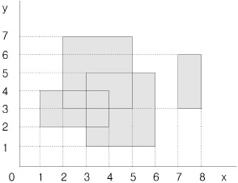

### 좌표 SHIFT

#### Think Proccss ⚡

1. 위 아래 움직임과 왼쪽 오른쪽 움직임을 담은 리스트 2개를 만들자
2. 수업을 듣고 코딩하는거지만 이걸 생각한 사람은 정말 대단한듯 하다
3. x,y의 움직임을 입력받는 변수인 d와 r을 이용해 표현하자

#### 코딩풀이 👀

```python
# 입력은
# 4 5 -> 4X5의 판

# 2 3 1 5 4  -> 줄마다의 값
# 1 3 5 4 2
# 1 8 3 6 1
# 8 9 7 2 4

# 2 1 0 2 -> 초기 위치 2,1 의 점을 0쪽으로 2만큼 움직여라

# 0 = 오른쪽으로
# 1 = 왼쪽으로3 4
# 2 = 아래쪽으로
# 3 = 위쪽으로

N, M = map(int, input().split()) # 우선 N과 M값을 받고

# # 0으로 이루어진 NXM 짜리 보드판을 만들고
board = [list(map(int, input().split())) for _ in range(N)]

x, y, d, r = map(int, input().split()) # x, y = 좌표 / d = 가야할 방향 / r = 얼만큼 가는지

    # 움직임을 나타내는 함수를 만들자

up_down = [0, 0, 1, -1]
left_right = [1, -1, 0, 0]

# x+r*up_down[d]    # 만약 x,y 가 2,1 에  d가 0, r이 2라면 
# y+r*left_right[d]  # x,y 는 2,3 즉 오른쪽으로 2칸 가게 된다.

if x+r*up_down[d] < 0 or x+r*up_down[d] >= M or y+r*left_right[d] < 0 or y+r*left_right[d] >= N:
    print('범위를 벗어남 다시 입력하시오')

else:
    answer = board[x+r*up_down[d]][y+r*left_right[d]]

    print('답은 {}입니다.'.format(answer))
```


---


### 백준 2669. 직사각형 네개의 합집합의 면적 구하기


평면에 네 개의 직사각형이 놓여 있는데 그 밑변은 모두 가로축에 평행하다. 이 네 개의 직사각형들은 서로 떨어져 있을 수도 있고, 겹쳐 있을 수도 있고, 하나가 다른 하나를 포함할 수도 있으며, 변이나 꼭짓점이 겹칠 수도 있다.

이 직사각형들이 차지하는 면적을 구하는 프로그램을 작성하시오.



## 입력

입력은 네 줄이며, 각 줄은 직사각형의 위치를 나타내는 네 개의 정수로 주어진다. 첫 번째와 두 번째의 정수는 사각형의 왼쪽 아래 꼭짓점의 x좌표, y좌표이고 세 번째와 네 번째의 정수는 사각형의 오른쪽 위 꼭짓점의 x좌표, y좌표이다. 모든 x좌표와 y좌표는 1이상이고 100이하인 정수이다.

## 출력

첫 줄에 네개의 직사각형이 차지하는 면적을 출력한다.

## 예제 입력 1 복사

```
1 2 4 4
2 3 5 7
3 1 6 5
7 3 8 6
```

## 예제 출력 1 복사

```
26
```


#### Think Proccss ⚡

1. 빈도화지를 만든다

2. 받은 데이터는 꼭지점 기준이기 때문에 데이터조정을 해준다

3. 각 직사각형들의 인덱스를 빈도화지에 +1씩 한다

4. 도화지에 칠해진 숫자들을 count해서 print해준다

   

#### 코딩풀이 👀

```python
# 우선 100 X 100 배열 도화지를 만들자
coordi = [[0]*100 for _ in range(100)]

# 4번의 반복동안 저 도화지에 색칠하는거여

for _ in range(4):
    x1, y1, x2, y2 = map(int, input().split())

    # 2차배열로 돌리면서 이 직사각형의 좌표를 도화지에 그린다
    # 단 현재 받은 좌표는 꼭짓점 좌표이므로 약간의 조정이 필요하다
    # 내가 편한 데이터로 만들기 위해서 
    # ex) 1 1 1
    #     1 1 1   이런 데이터가 있다하면 1의 갯수를 세고 넓이가 6이라 출력가능
    # x2, y2 데이터를 각각 -1씩 해주면 원하는 데이터로 사용할 수 있다.
    x1, y1, x2, y2 = x1, y1, x2-1, y2-1
    for i in range(x1, x2+1):  # 결국 range에 특성상 +1을 해줘서 그게 그거긴 해졌지만 개념은 다름
        for j in range(y1, y2+1):
            coordi[i][j] += 1

# 도화지 색칠이 다 끝나면
# 칠해진 2차원 도화지를 탐색하며 칠해져있으면 width에 1씩 추가
width = 0
for a in range(len(coordi)):
    for b in range(len(coordi)):
        if coordi[a][b] > 0:
            width += 1

print(width)
```


---


### 2635 수 이어가기


다음과 같은 규칙에 따라 수들을 만들려고 한다.

1. 첫 번째 수로 양의 정수가 주어진다.
2. 두 번째 수는 양의 정수 중에서 하나를 선택한다.
3. 세 번째부터 이후에 나오는 모든 수는 앞의 앞의 수에서 앞의 수를 빼서 만든다. 예를 들어, 세 번째 수는 첫 번째 수에서 두 번째 수를 뺀 것이고, 네 번째 수는 두 번째 수에서 세 번째 수를 뺀 것이다.
4. 음의 정수가 만들어지면, 이 음의 정수를 버리고 더 이상 수를 만들지 않는다.

첫 번째 수로 100이 주어질 때, 두 번째 수로 60을 선택하여 위의 규칙으로 수들을 만들면 7개의 수들 100, 60, 40, 20, 20 , 0, 20이 만들어진다. 그리고 두 번째 수로 62를 선택하여 위의 규칙으로 수들을 만들면 8개의 수들 100, 62, 38, 24, 14, 10, 4, 6이 만들어진다. 위의 예에서 알 수 있듯이, 첫 번째 수가 같더라도 두 번째 수에 따라서 만들어지는 수들의 개수가 다를 수 있다.

입력으로 첫 번째 수가 주어질 때, 이 수에서 시작하여 위의 규칙으로 만들어지는 최대 개수의 수들을 구하는 프로그램을 작성하시오. 최대 개수의 수들이 여러 개일 때, 그중 하나의 수들만 출력하면 된다.

## 입력

첫 번째 수가 주어진다. 이 수는 30,000 보다 같거나 작은 양의 정수이다.

## 출력

첫 번째 줄에는 입력된 첫 번째 수로 시작하여 위의 규칙에 따라 만들 수 있는 수들의 최대 개수를 출력한다.

둘째 줄에 그 최대 개수의 수들을 차례대로 출력한다. 이들 수 사이에는 빈칸을 하나씩 둔다.

## 예제 입력 1 복사

```
100
```

## 예제 출력 1 복사

```
8
100 62 38 24 14 10 4 6
```


#### Think Proccss ⚡

1. 원래는 후보가 될만한 2번째 수의 범위를 설정하고 시작하려 했지만 변수가 생길 수 있으니 그냥 완전탐색하자!
2. 첫번째, 두번째, 세번째 수가 서로의 변수가 되어 계속 이동해야한다
3. 모든 경우의 수를 구한 후 그 중 가장 count가 많은 경우의 count수와 그에 맞는 수들을 출력하자

#### 코딩풀이 👀

```python
N = int(input())

count = 0 # 가장 큰 수만을 남겨두아 나중에 출력
answer = [] # 우선은 리스트로 answer가 되는 수를 뽑아보자
for second in range(1, N+1): # 처음에 range(N)으로 했다가 N이 1일때 예외사항이 나와서 계속 틀림  
    reserve_count = 0 # 최종 카운트로 가기전 후보군들
    third = N-second # 3번째로 오는 수  
    first = N # 첫번째로 오는 수
    reserve_answer = [first, second, thrid] 
    while thrid >= 0:
        third = second-third
        second = first-second # 다음 회차에 second이기 때문에 f-s 가 가능
        first = second+thrid # 위에 두 계산으로 변화된 second, thrid이기에 가능
        reserve_count += 1  # 한 턴마다 예비 정답에 count와 숫자 추가
        reserve_answer += [j]
    
    if count < reserve_count: # 최대값의 count를 구하며 answer에도 그 값들을 담기 위함
        count = reserve_count
        answer = reserve_answer

answer_ = ''  # 스트링화해서 뽑아야 하므로 answer리스트를 스트링화
for a in range(len(answer)-1):
    answer_ += str(answer[a]) + ' '

print(count+2) # 처음에 1,2,3번째 오는 수를 포함하고 count했기 때문에 +2 해줘야함
print(answer_)
```


---


