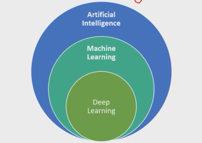

## 머신러닝

- 인공지능 : 사람의 지능을 모방하여, 사람이 하는 것과 같이 복잡한 일을 할 수 있게 기계를 만드는 것
- 머신러닝 : 기본적으로 알고리즘을 이용해 데이터를 분석 및 학습하며, 학습한 내용을 기반으로 판단하여 예측
- 딥러닝 : 인공신경망에서 발전한 형태의 인공 지능,  머신러닝 중 하나의 방법론

머신러닝은 **데이터**를 기반으로 **패턴**을 학습하여 결과를 **추론**하는 것!

- 지도학습 : Data가 있고 예측해야할 값들이 있는 경우 / 정답이 있다!
  - 회귀 : 수치형 (numeric value) / 집 값, 가격, 온도 등
  - 분류 : 분류형 (categorical value) / 스팸메일, 종류판별, 암 진단 등
- 비지도학습: Data만 있고 예측해야할 값들이 없다 / 정답이 없다 스스로!
  - 군집화 : 그룹핑 / 뉴스 분류, 사용자 관심사 등
  - 차원 축소

## 가설함수, 비용, 손실함수

